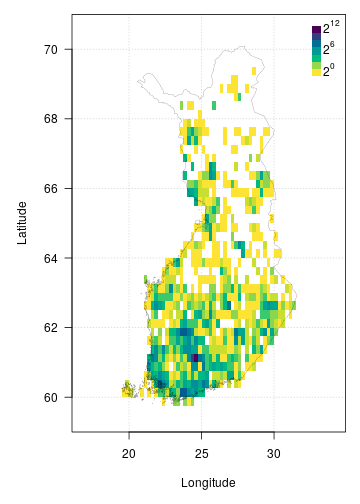

FinBIF aggregates Finnish biodiversity data from multiple sources in a single
open access portal for researchers, citizen scientists, industry and government.
FinBIF allows users of biodiversity information to find, access, combine and 
visualise data on Finnish plants, animals and microorganisms. The `finbif`
R package makes the publicly available data in FinBIF easily accessible to
programmers. Biodiversity information is available on taxonomy and taxon
occurrence. Occurrence data can be filtered by taxon, time, location and other
variables. The data accessed are conveniently preformatted for subsequent
analyses.

## Installing the finbif package
You can install the current stable version of `finbif` from
[CRAN](https://cran.r-project.org),

```r
install.packages("finbif")
```

You can also install the latest development version of `finbif` from
[GitHub](https://github.com),

```r
remotes::install_github("luomus/finbif@dev")
```

## Loading the finbif package

```r
library(finbif)
```

## Getting a FinBIF access token
To use the FinBIF API you must first request and set a personal access token.
You can request an API token to be sent to your email address with the function
`finbif_get_token`.

```r
finbif_request_token("your@email.com")
```

Copy the access token that was sent to your email and set it as the environment
variable `FINBIF_ACCESS_TOKEN` either for the current session,

```r
Sys.setenv(
  FINBIF_ACCESS_TOKEN = "xtmSOIxjPwq0pOMB1WvcZgFLU9QBklauOlonWl8K5oaLIx8RniJLrvcJU4v9H7Et"
)
# Note: the above is not a real access token. Do not try using it.
```
, or by adding it to a `Renviron` startup file (see
[here](https://rviews.rstudio.com/2017/04/19/r-for-enterprise-understanding-r-s-startup/)
for details).

## Working with taxa
You can check to see if a taxon exists in the FinBIF database.

```r
finbif_check_taxa("Ursus arctos")
#> [Ursus arctos] ID: MX.47348
```

If the taxon is in the FinBIF database its unique ID is returned. When a taxon
is not in the FinBIF database it is reported as "not found" and for that taxa
the list element is `NA`.

```r
(taxa <- finbif_check_taxa(c("Ursus arctos", "Moomin")))
#> [Ursus arctos] ID: MX.47348
#> [Moomin      ] Not found
taxa[[1]]
#> Ursus arctos 
#>   "MX.47348"
taxa[[2]]
#> Moomin 
#>     NA
```

You can also specify the taxonomic rank when searching FinBIF and the search
will be limited to the specified rank.

```r
finbif_check_taxa(list(species = c("Ursus arctos", "Ursus"), genus = "Ursus"))
#> [species: Ursus arctos] ID: MX.47348
#> [species: Ursus       ] Not found
#> [genus:   Ursus       ] ID: MX.51311
```

The function `finbif_taxa()` can be used for a more general search for taxa in
the FinBIF database. Searches can be `exact`, `partial` or `likely` (fuzzy
matching). Information for a single taxon is returned when using exact or fuzzy
matching, but multiple taxa, up to a limit, `n`, may be returned when using
partial matching.

```r
birch_search <- finbif_taxa("Betula pendula", 2, "partial")
birch_search$content
```
<details closed>
<summary> Click to show/hide output. </summary>

```r

[[1]]
[[1]]$matchingName
[1] "Betula pendula var. pendula"

[[1]]$nameType
[1] "MX.scientificName"

[[1]]$id
[1] "MX.37994"

[[1]]$scientificName
[1] "Betula pendula var. pendula"

[[1]]$taxonRank
[1] "MX.variety"

[[1]]$cursiveName
[1] TRUE

[[1]]$finnish
[1] TRUE

[[1]]$species
[1] TRUE

[[1]]$vernacularName
[[1]]$vernacularName$fi
[1] "vihtakoivu"

[[1]]$vernacularName$sv
[1] "vanlig vårtbjörk"


[[1]]$informalGroups
[[1]]$informalGroups[[1]]
[[1]]$informalGroups[[1]]$id
[1] "MVL.343"

[[1]]$informalGroups[[1]]$name
[[1]]$informalGroups[[1]]$name$en
[1] "Vascular plants"

[[1]]$informalGroups[[1]]$name$fi
[1] "Putkilokasvit"

[[1]]$informalGroups[[1]]$name$sv
[1] "Kärlväxter"


[[1]]$type
[1] "partialMatches"


[[2]]
[[2]]$matchingName
[1] "Betula pendula var. carelica"

[[2]]$nameType
[1] "MX.scientificName"

[[2]]$id
[1] "MX.37997"

[[2]]$scientificName
[1] "Betula pendula var. carelica"

[[2]]$scientificNameAuthorship
[1] "(Merckl.) Hämet-Ahti"

[[2]]$taxonRank
[1] "MX.variety"

[[2]]$cursiveName
[1] TRUE

[[2]]$finnish
[1] TRUE

[[2]]$species
[1] TRUE

[[2]]$vernacularName
[[2]]$vernacularName$fi
[1] "visakoivu"

[[2]]$vernacularName$sv
[1] "masurbjörk"


[[2]]$informalGroups
[[2]]$informalGroups[[1]]
[[2]]$informalGroups[[1]]$id
[1] "MVL.343"

[[2]]$informalGroups[[1]]$name
[[2]]$informalGroups[[1]]$name$en
[1] "Vascular plants"

[[2]]$informalGroups[[1]]$name$fi
[1] "Putkilokasvit"

[[2]]$informalGroups[[1]]$name$sv
[1] "Kärlväxter"


[[2]]$type
[1] "partialMatches"

```

</details>
<br>

## Getting occurrence data
You can download occurrence data from the FinBIF database as a `data.frame` with
the `finbif_occurrence()` function.

```r
finbif_occurrence("Cygnus cygnus", n = 100)
#> Records downloaded: 100
#> Records available: 56137
#> A data.frame [100 x 30]
#>    scientific_name abundance lat_wgs84 lon_wgs84           date_time
#> 1    Cygnus cygnus         2  61.12368  21.53212 2020-01-31 09:55:00
#> 2    Cygnus cygnus         3  60.45850  22.37715 2020-01-26 22:00:00
#> 3    Cygnus cygnus        12  60.56757  21.57197 2020-01-24 22:00:00
#> 4    Cygnus cygnus        17  60.56757  21.57197 2020-01-24 22:00:00
#> 5    Cygnus cygnus        23  60.94748  26.58934 2020-01-23 22:00:00
#> 6    Cygnus cygnus         4  61.10051  21.55668 2020-01-23 09:05:00
#> 7    Cygnus cygnus         2  62.22059  24.63009 2020-01-18 07:20:00
#> 8    Cygnus cygnus        65  60.77776  21.47181 2020-01-17 09:00:00
#> 9    Cygnus cygnus         5  61.11829  21.52784 2020-01-08 08:00:00
#> 10   Cygnus cygnus        30  61.03529  26.13553 2020-01-07 22:00:00
#> ...with 90 more records and 25 more variables:
#> taxon_rank, country, province, municipality, date_start, date_end,
#> hour_start, hour_end, minute_start, minute_end, record_id,
#> individual_id, event_id, collection_id, any_issues, record_issue,
#> record_reliable, taxon_reliability, document_issue,
#> collection_reliability, coordinates_uncertainty, event_issue,
#> location_issue, time_issue, duration
```

You can search for multiple taxa at once and filter the records with the
`filter` argument.

```r
finbif_occurrence(
  "Cygnus cygnus", 
  "Cygnus olor",
  filter = list(coordinates_uncertainty_max = 100)
)
```
<details closed>
<summary> Click to show/hide output. </summary>

```r

Records downloaded: 10
Records available: 11395
A data.frame [10 x 30]
   scientific_name abundance lat_wgs84 lon_wgs84           date_time
1      Cygnus olor         1  60.17824  24.94096 2020-02-03 22:00:00
2    Cygnus cygnus         2  61.12368  21.53212 2020-01-31 09:55:00
3      Cygnus olor         1  60.45850  22.37715 2020-01-26 22:00:00
4    Cygnus cygnus         3  60.45850  22.37715 2020-01-26 22:00:00
5      Cygnus olor         1  61.11068  21.53062 2020-01-25 06:55:00
6      Cygnus olor         2  60.56757  21.57197 2020-01-24 22:00:00
7    Cygnus cygnus        12  60.56757  21.57197 2020-01-24 22:00:00
8    Cygnus cygnus        17  60.56757  21.57197 2020-01-24 22:00:00
9    Cygnus cygnus        23  60.94748  26.58934 2020-01-23 22:00:00
10     Cygnus olor         2  60.94740  26.58939 2020-01-23 22:00:00
...with 0 more records and 25 more variables:
taxon_rank, country, province, municipality, date_start, date_end,
hour_start, hour_end, minute_start, minute_end, record_id,
individual_id, event_id, collection_id, any_issues, record_issue,
record_reliable, taxon_reliability, document_issue,
collection_reliability, coordinates_uncertainty, event_issue,
location_issue, time_issue, duration

```

</details>
<br>

See `?filters` and `vignette("v0_filtering")` for more details on filtering
FinBIF records.

### Random sampling
It is possible to request a random sample of records instead of the last `n`
records (or records ordered by some other variable).

```r
finbif_occurrence("Birds", sample = TRUE)
```
<details closed>
<summary> Click to show/hide output. </summary>

```r

Records downloaded: 10
Records available: 17764091
A data.frame [10 x 30]
        scientific_name abundance lat_wgs84 lon_wgs84           date_time
1    Ficedula hypoleuca         1  66.93333  24.51667 1974-07-06 22:00:00
2     Fringilla coelebs         1  61.23566  24.11011 1995-06-18 01:30:00
3       Passer montanus         2  60.81331  26.35391 2006-06-28 21:00:00
4       Hirundo rustica         1  61.14266  24.37962 2010-08-17 18:00:00
5     Fringilla coelebs         1  62.69656  22.36466 2013-06-01 00:57:00
6  Fringilla montifrin…         1  60.27855  24.41111 1995-10-21 06:00:00
7   Cyanistes caeruleus         1  60.61667  21.80000 1989-07-10 05:00:00
8     Fringilla coelebs         1  60.89581  22.10192 2012-06-09 07:00:00
9     Falco tinnunculus         1  60.64095  27.89334 2003-07-07 21:00:00
10   Bucephala clangula        10  59.81111  22.89545 2007-01-14 22:00:00
...with 0 more records and 25 more variables:
taxon_rank, country, province, municipality, date_start, date_end,
hour_start, hour_end, minute_start, minute_end, record_id,
individual_id, event_id, collection_id, any_issues, record_issue,
record_reliable, taxon_reliability, document_issue,
collection_reliability, coordinates_uncertainty, event_issue,
location_issue, time_issue, duration

```

</details>
<br>

## Plotting occurrence data
The `finbif` package has a number of inbuilt functions for plotting (see e.g.,
`breaks_xy()` and `hist_xy()`). There is also an inbuilt dataset that can be
used to plot the border of Finland (`?finland_map`). Together these utilities
can be used to plot occurrences after they have been downloaded from FinBIF. For
example, the following can be used to plot the density of Eurasian Jay
occurrences from Finland.

<details closed>
<summary><span title=''>Click to show/hide code.</span></summary>

```r
# Download all the occurrences of Eurasian Jay in Finland
# that have coordinates accurate to at least 100m
jays <- finbif_occurrence(
  taxa   = "Eurasian Jay",
  filter = c(
    coordinates_uncertainty_max = 100,
    country                     = "Finland"
  ),
  n      = 2e4,
  quiet  = TRUE
)

# Compute the density of occurrences in 1/4 degree cells and plot as a heatmap
with(
  data = c(jays, finland_map),
  expr = {
    par(mar = c(5, 5, 1, 1), las = 1)
    # compute a 2d histogram from the occurrences
    breaks  <- breaks_xy(bbox, .25) # breakpoints every 1/4 of a degree
    density <- hist_xy(xy = list(lon_wgs84, lat_wgs84), breaks)
    # plot the histogram as a heatmap
    image(density,
          asp    = 2.4,
          breaks = 2^seq(0, 12), # breakpoints for the gridcell colours
          col    = hcl.colors(12, rev = TRUE),
          xlab   = "Longitude",
          ylab   = "Latitude",
          panel.first = grid())
    legend("topright",
           inset  = c(0, .01),
           legend = expression(2^12, "", "", 2^6, "", "", 2^0),
           fill   = hcl.colors(7),
           border = NA,
           bty    = "n",
           adj    = c(0, 0.25), 
           x.intersp = .2,
           y.intersp = .5)
    # add the Finnish border
    polygon(x = vertices, lwd = .2)
  }
)
```
</details>


## Caching
By default `finbif` uses local caching for repeated API requests. This
can be turned on or off on a per request or session basis. See `?caching` for
details.
