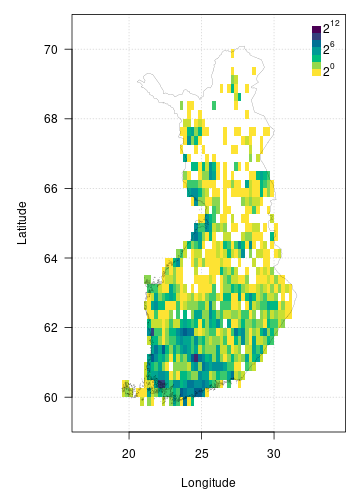

FinBIF aggregates Finnish biodiversity data from multiple sources in a single
open access portal for researchers, citizen scientists, industry and government.
FinBIF allows users of biodiversity information to find, access, combine and 
visualise data on Finnish plants, animals and microorganisms. The `{finbif}`
R package makes the publicly available data in FinBIF easily accessible to
programmers. Biodiversity information is available on taxonomy and taxon
occurrence. Occurrence data can be filtered by taxon, time, location and other
variables. The data accessed are conveniently preformatted for subsequent
analyses.

## Installing the finbif package
You can install the current stable version of `{finbif}` from
[CRAN](https://cran.r-project.org),

```r
install.packages("finbif")
```

You can also install the latest development version of `{finbif}` from
[GitHub](https://github.com),

```r
remotes::install_github("luomus/finbif@dev")
```

## Loading the finbif package

```r
library(finbif)
```

## Getting a FinBIF access token
To use the FinBIF API you must first request and set a personal access token.
You can request an API token to be sent to your email address with the function
`finbif_get_token()`.

```r
finbif_request_token("your@email.com")
```

Copy the access token that was sent to your email and set it as the environment
variable `FINBIF_ACCESS_TOKEN` either for the current session,

```r
Sys.setenv(
  FINBIF_ACCESS_TOKEN = "xtmSOIxjPwq0pOMB1WvcZgFLU9QBklauOlonWl8K5oaLIx8RniJLrvcJU4v9H7Et"
)
# Note: the above is not a real access token. Do not try using it.
```
, or by adding it to a `Renviron` startup file (see
[here](https://rviews.rstudio.com/2017/04/19/r-for-enterprise-understanding-r-s-startup/)
for details).

## Working with taxa
You can check to see if a taxon exists in the FinBIF database.

```r
finbif_check_taxa("Ursus arctos")
#> [Ursus arctos] ID: MX.47348
```

If the taxon is in the FinBIF database its unique ID is returned. When a taxon
is not in the FinBIF database it is reported as "not found" and for that taxa
the list element is `NA`.

```r
(taxa <- finbif_check_taxa(c("Ursus arctos", "Moomin")))
#> [Ursus arctos] ID: MX.47348
#> [Moomin      ] Not found
taxa[[1]]
#> Ursus arctos 
#>   "MX.47348"
taxa[[2]]
#> Moomin 
#>     NA
```

You can also specify the taxonomic rank when searching FinBIF and the search
will be limited to the specified rank.

```r
finbif_check_taxa(list(species = c("Ursus arctos", "Ursus"), genus = "Ursus"))
#> [species: Ursus arctos] ID: MX.47348
#> [species: Ursus       ] Not found
#> [genus:   Ursus       ] ID: MX.51311
```

The function `finbif_taxa()` can be used for a more general search for taxa in
the FinBIF database. Searches can be `exact`, `partial` or `likely` (fuzzy
matching). Information for a single taxon is returned when using exact or fuzzy
matching, but multiple taxa, up to a limit, `n`, may be returned when using
partial matching.

```r
birch_search <- finbif_taxa("Betula pendula", 2, "partial")
birch_search$content
```


<details closed>
<summary> Click to show/hide output. </summary>

```r

#> [[1]]
#> [[1]]$matchingName
#> [1] "Betula pendula var. pendula"
#> 
#> [[1]]$nameType
#> [1] "MX.scientificName"
#> 
#> [[1]]$id
#> [1] "MX.37994"
#> 
#> [[1]]$scientificName
#> [1] "Betula pendula var. pendula"
#> 
#> [[1]]$taxonRank
#> [1] "MX.variety"
#> 
#> [[1]]$cursiveName
#> [1] TRUE
#> 
#> [[1]]$finnish
#> [1] TRUE
#> 
#> [[1]]$species
#> [1] TRUE
#> 
#> [[1]]$vernacularName
#> [[1]]$vernacularName$fi
#> [1] "vihtakoivu"
#> 
#> [[1]]$vernacularName$sv
#> [1] "vanlig vårtbjörk"
#> 
#> 
#> [[1]]$informalGroups
#> [[1]]$informalGroups[[1]]
#> [[1]]$informalGroups[[1]]$id
#> [1] "MVL.343"
#> 
#> [[1]]$informalGroups[[1]]$name
#> [[1]]$informalGroups[[1]]$name$fi
#> [1] "Putkilokasvit"
#> 
#> [[1]]$informalGroups[[1]]$name$sv
#> [1] "Kärlväxter"
#> 
#> [[1]]$informalGroups[[1]]$name$en
#> [1] "Vascular plants"
#> 
#> 
#> 
#> 
#> [[1]]$type
#> [1] "partialMatches"
#> 
#> 
#> [[2]]
#> [[2]]$matchingName
#> [1] "Betula pendula var. carelica"
#> 
#> [[2]]$nameType
#> [1] "MX.scientificName"
#> 
#> [[2]]$id
#> [1] "MX.37997"
#> 
#> [[2]]$scientificName
#> [1] "Betula pendula var. carelica"
#> 
#> [[2]]$scientificNameAuthorship
#> [1] "(Merckl.) Hämet-Ahti"
#> 
#> [[2]]$taxonRank
#> [1] "MX.variety"
#> 
#> [[2]]$cursiveName
#> [1] TRUE
#> 
#> [[2]]$finnish
#> [1] TRUE
#> 
#> [[2]]$species
#> [1] TRUE
#> 
#> [[2]]$vernacularName
#> [[2]]$vernacularName$fi
#> [1] "visakoivu"
#> 
#> [[2]]$vernacularName$sv
#> [1] "masurbjörk"
#> 
#> 
#> [[2]]$informalGroups
#> [[2]]$informalGroups[[1]]
#> [[2]]$informalGroups[[1]]$id
#> [1] "MVL.343"
#> 
#> [[2]]$informalGroups[[1]]$name
#> [[2]]$informalGroups[[1]]$name$fi
#> [1] "Putkilokasvit"
#> 
#> [[2]]$informalGroups[[1]]$name$sv
#> [1] "Kärlväxter"
#> 
#> [[2]]$informalGroups[[1]]$name$en
#> [1] "Vascular plants"
#> 
#> 
#> 
#> 
#> [[2]]$type
#> [1] "partialMatches"
#> 
#> 

```

</details>
<br>

## Getting occurrence data
You can download occurrence data from the FinBIF database as a `data.frame` with
the `finbif_occurrence()` function.

```r
finbif_occurrence("Cygnus cygnus", n = 100)
#> Records downloaded: 100
#> Records available: 57008
#> A data.frame [100 x 12]
#>               record_id scientific_name abundance lat_wgs84 lon_wgs84           date_time
#> 1  KE.176/5e9dd5782d0e…   Cygnus cygnus  1         62.79256  30.96101 2020-04-20 12:00:00
#> 2        JX.1108556#265   Cygnus cygnus  2         64.2081   29.03035 2020-04-19 12:00:00
#> 3         JX.1110250#40   Cygnus cygnus  20        63.12255  24.32082 2020-04-19 05:00:00
#> 4          JX.1110117#3   Cygnus cygnus  2         65.87333  24.28142 2020-04-19 17:00:00
#> 5         JX.1110052#46   Cygnus cygnus  2         61.13841  21.64607 2020-04-19 06:35:00
#> 6         JX.1110024#10   Cygnus cygnus  2         60.32418  22.39303 2020-04-18 12:00:00
#> 7          JX.1110008#3   Cygnus cygnus  10        64.17427  25.9137  2020-04-17 12:00:00
#> 8         JX.1109958#52   Cygnus cygnus  2         61.32291  28.56818 2020-04-17 05:45:00
#> 9          JX.1109939#4   Cygnus cygnus  2         61.2604   28.71105 2020-04-17 12:27:00
#> 10         JX.1109952#4   Cygnus cygnus  4         61.2641   28.70687 2020-04-16 11:33:00
#> ...with 90 more records and 6 more variables:
#> coordinates_uncertainty, any_issues, requires_verification, requires_identification,
#> record_reliability, record_quality
```

You can search for multiple taxa at once and filter the records with the
`filter` argument.

```r
finbif_occurrence(
  "Cygnus cygnus", 
  "Cygnus olor",
  filter = list(coordinates_uncertainty_max = 100)
)
```


<details closed>
<summary> Click to show/hide output. </summary>

```r

#> Records downloaded: 10
#> Records available: 11553
#> A data.frame [10 x 12]
#>             record_id scientific_name abundance lat_wgs84 lon_wgs84           date_time
#> 1       JX.1110624#19     Cygnus olor  2         60.13623  24.65125 2020-04-21 11:30:00
#> 2       JX.1110052#46   Cygnus cygnus  2         61.13841  21.64607 2020-04-19 06:35:00
#> 3  HR.3211/42456319-U     Cygnus olor  1         60.17978  24.93999 2020-04-18 12:00:00
#> 4        JX.1109939#4   Cygnus cygnus  2         61.2604   28.71105 2020-04-17 12:27:00
#> 5       JX.1109826#13     Cygnus olor  2         60.79963  21.39606 2020-04-17 11:30:00
#> 6       JX.1109535#12   Cygnus cygnus  2         66.27089  29.3796  2020-04-15 12:00:00
#> 7        JX.1109515#4   Cygnus cygnus  1         65.01262  25.43289 2020-04-14 12:00:00
#> 8        JX.1109461#4   Cygnus cygnus  2         60.92088  26.38893 2020-04-14 12:00:00
#> 9       JX.1109294#76     Cygnus olor  2         60.42794  22.20052 2020-04-13 12:00:00
#> 10      JX.1109218#22   Cygnus cygnus  1         61.09307  21.55221 2020-04-13 06:45:00
#> ...with 0 more records and 6 more variables:
#> coordinates_uncertainty, any_issues, requires_verification, requires_identification,
#> record_reliability, record_quality

```

</details>
<br>

See `?filters` and `vignette("v05_filtering")` for more details on filtering
FinBIF records.

### Random sampling
It is possible to request a random sample of records instead of the last `n`
records (or records ordered by some other variable).

```r
finbif_occurrence("Birds", sample = TRUE)
```


<details closed>
<summary> Click to show/hide output. </summary>

```r

#> Records downloaded: 10
#> Records available: 17833621
#> A data.frame [10 x 12]
#>              record_id      scientific_name abundance lat_wgs84 lon_wgs84           date_time
#> 1       JX.1027476#519    Fringilla coelebs  1         59.86154  23.16479 1997-06-10 07:20:00
#> 2  KE.67/11806345#Unit      Corvus monedula  1         60.82859  24.25148 2000-01-01 12:00:00
#> 3  KE.383/4571#UNIT170      Passer montanus  6         63.05393  25.90933 2015-04-16 12:00:00
#> 4     MKH.20030914#593       Motacilla alba  133       59.81111  22.89545 2003-09-14 12:00:00
#> 5     MKH.20000726#566         Hirundininae  80        59.81111  22.89545 2000-07-26 12:00:00
#> 6   KE.67/8317861#Unit Phoenicurus phoenic…  1         59.83333  21.61667 2002-05-04 13:00:00
#> 7     MKH.20140510#553      Alauda arvensis  2         59.81111  22.89545 2014-05-10 12:00:00
#> 8   KE.67/5518966#Unit  Aegithalos caudatus  1         59.81667  22.9     1996-10-11 18:00:00
#> 9   KE.67/3683617#Unit Acanthis hornemanni…  1         63.95     22.85    2013-10-25 18:00:00
#> 10         MHU.1732099      Strix uralensis  1         62.34485  27.10288 2006-04-19 12:00:00
#> ...with 0 more records and 6 more variables:
#> coordinates_uncertainty, any_issues, requires_verification, requires_identification,
#> record_reliability, record_quality

```

</details>
<br>

## Plotting occurrence data
The `{finbif}` package has a number of inbuilt functions for plotting (see e.g.,
`breaks_xy()` and `hist_xy()`). There is also an inbuilt dataset that can be
used to plot the border of Finland (`?finland_map`). Together these utilities
can be used to plot occurrences after they have been downloaded from FinBIF. For
example, the following can be used to plot the density of Eurasian Jay
occurrences from Finland.

<details closed>
<summary><span title=''>Click to show/hide code.</span></summary>

```r
# Download all the occurrences of Eurasian Jay in Finland
# that have coordinates accurate to at least 100m
jays <- finbif_occurrence(
  taxa   = "Eurasian Jay",
  filter = c(
    coordinates_uncertainty_max = 100,
    country                     = "Finland"
  ),
  n      = 2e4,
  quiet  = TRUE
)

# Compute the density of occurrences in 1/4 degree cells and plot as a heatmap
with(
  data = c(jays, finland_map),
  expr = {
    par(mar = c(5, 5, 1, 1), las = 1)
    # compute a 2d histogram from the occurrences
    breaks  <- breaks_xy(bbox, .25) # breakpoints every 1/4 of a degree
    density <- hist_xy(xy = list(lon_wgs84, lat_wgs84), breaks)
    # plot the histogram as a heatmap
    image(density,
          asp    = 2.4,
          breaks = 2^seq(0, 12), # breakpoints for the gridcell colours
          col    = hcl.colors(12, rev = TRUE),
          xlab   = "Longitude",
          ylab   = "Latitude",
          panel.first = grid())
    legend("topright",
           inset  = c(0, .01),
           legend = expression(2^12, "", "", 2^6, "", "", 2^0),
           fill   = hcl.colors(7),
           border = NA,
           bty    = "n",
           adj    = c(0, 0.25), 
           x.intersp = .2,
           y.intersp = .5)
    # add the Finnish border
    polygon(x = vertices, lwd = .2)
  }
)
```
</details>


## Caching
By default `{finbif}` uses local caching for repeated API requests. This can be
turned on or off on a per request or session basis. See `?caching` for details.
