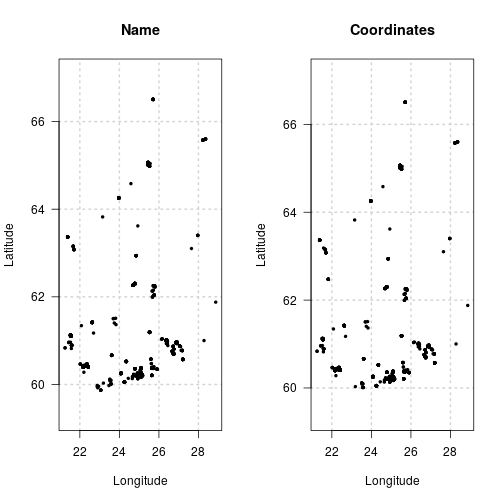

When getting records from FinBIF there are many options for filtering the data
before it is downloaded, saving bandwidth and local post-processing time. For
the full list of filtering options see `?filters`.

## Loading finbif

```r
library(finbif)
```

## Location
Records can be filtered by the name of a location or by a set of coordinates.

```r
filter1 <- c(country = "Finland")
filter2 <- list(coordinates = list(c(60, 68), c(20, 30), "wgs84"))
par(mfcol = 1:2)
plot(finbif_occurrence(filter = filter1, n = 1000), main = "Name")
plot(finbif_occurrence(filter = filter2, n = 1000), main = "Coordinates")
```



See `?filters` section "Location" for more details

## Time
The event or import date of records can be used to filter occurrence data from
FinBIF. The date filters can be a single year, month or date,

```r
finbif_occurrence(filter = list(date_range_ym = c("2019-12")))
```
<details closed>
<summary> Click to show/hide output. </summary>

```r

Records downloaded: 10
Records available: 7150
A data.frame [10 x 30]
       scientific_name abundance lat_wgs84 lon_wgs84           date_time
1            Pica pica         6   62.7154   23.0893 2019-12-31 08:15:00
2     Poecile montanus         1   62.7154   23.0893 2019-12-31 08:15:00
3    Dendrocopos major         2   62.7154   23.0893 2019-12-31 08:15:00
4      Corvus monedula         8   62.7154   23.0893 2019-12-31 08:15:00
5      Passer montanus        11   62.7154   23.0893 2019-12-31 08:15:00
6  Cyanistes caeruleus         5   62.7154   23.0893 2019-12-31 08:15:00
7          Parus major        20   62.7154   23.0893 2019-12-31 08:15:00
8     Acanthis flammea        12   62.7154   23.0893 2019-12-31 08:15:00
9    Passer domesticus        22   62.7154   23.0893 2019-12-31 08:15:00
10     Chloris chloris         6   62.7154   23.0893 2019-12-31 08:15:00
...with 0 more records and 25 more variables:
taxon_rank, country, province, municipality, date_start, date_end,
hour_start, hour_end, minute_start, minute_end, record_id,
individual_id, event_id, collection_id, any_issues, record_issue,
record_reliable, taxon_reliability, document_issue,
collection_reliability, coordinates_uncertainty, event_issue,
location_issue, time_issue, duration

```

</details>
<br>
, or for record events, a range as a character vector or an
[Interval](https://lubridate.tidyverse.org/reference/Interval-class.html)
object.

```r
finbif_occurrence(
  filter = list(date_range_ymd = c("2019-06-01", "2019-12-31"))
)
```
<details closed>
<summary> Click to show/hide output. </summary>

```r

Records downloaded: 10
Records available: 227693
A data.frame [10 x 30]
       scientific_name abundance lat_wgs84 lon_wgs84           date_time
1            Pica pica         6   62.7154   23.0893 2019-12-31 08:15:00
2     Poecile montanus         1   62.7154   23.0893 2019-12-31 08:15:00
3    Dendrocopos major         2   62.7154   23.0893 2019-12-31 08:15:00
4      Corvus monedula         8   62.7154   23.0893 2019-12-31 08:15:00
5      Passer montanus        11   62.7154   23.0893 2019-12-31 08:15:00
6  Cyanistes caeruleus         5   62.7154   23.0893 2019-12-31 08:15:00
7          Parus major        20   62.7154   23.0893 2019-12-31 08:15:00
8     Acanthis flammea        12   62.7154   23.0893 2019-12-31 08:15:00
9    Passer domesticus        22   62.7154   23.0893 2019-12-31 08:15:00
10     Chloris chloris         6   62.7154   23.0893 2019-12-31 08:15:00
...with 0 more records and 25 more variables:
taxon_rank, country, province, municipality, date_start, date_end,
hour_start, hour_end, minute_start, minute_end, record_id,
individual_id, event_id, collection_id, any_issues, record_issue,
record_reliable, taxon_reliability, document_issue,
collection_reliability, coordinates_uncertainty, event_issue,
location_issue, time_issue, duration

```

</details>
<br>

Records for a specific season or time-span across all years can also be
requested.

```r
finbif_occurrence(
  filter = list(
    date_range_md = c(begin = "12-21", end = "12-31"),
    date_range_md = c(begin = "01-01", end = "02-20")
  )
)
```
<details closed>
<summary> Click to show/hide output. </summary>

```r

Records downloaded: 10
Records available: 1471374
A data.frame [10 x 30]
        scientific_name abundance lat_wgs84 lon_wgs84           date_time
1                  <NA>         1  60.66508  23.60832 2020-01-14 08:47:00
2                  <NA>         1  60.66508  23.60832 2020-01-14 08:47:00
3   Fomitopsis pinicola         1  64.97964  25.52697 2020-01-13 22:00:00
4  Basidioradulum radu…         1  64.97964  25.52697 2020-01-13 22:00:00
5  Trichaptum abietinum         1  64.97964  25.52697 2020-01-13 22:00:00
6     Inonotus obliquus         1  64.97964  25.52697 2020-01-13 22:00:00
7     Dendrocopos major         2  60.42794  22.20052 2020-01-13 22:00:00
8         Turdus merula         1  60.42794  22.20052 2020-01-13 22:00:00
9     Pyrrhula pyrrhula         1  60.42794  22.20052 2020-01-13 22:00:00
10  Carduelis carduelis         1  60.42794  22.20052 2020-01-13 22:00:00
...with 0 more records and 25 more variables:
taxon_rank, country, province, municipality, date_start, date_end,
hour_start, hour_end, minute_start, minute_end, record_id,
individual_id, event_id, collection_id, any_issues, record_issue,
record_reliable, taxon_reliability, document_issue,
collection_reliability, coordinates_uncertainty, event_issue,
location_issue, time_issue, duration

```

</details>
<br>

## Data Quality
You can filter occurrence records by indicators of data quality. See `?filters`
section "Quality" for details.

```r
strict <- c(
  collection_reliability = 5, coordinates_uncertainty_max = 1,
  taxon_reliability = "reliable"
)
permissive <- list(
  collection_reliability = 1:5, coordinates_uncertainty_max = 10000,
  quality_issues = "both"
)
c(
  strict     = finbif_occurrence(filter = strict,     count_only = TRUE),
  permissive = finbif_occurrence(filter = permissive, count_only = TRUE)
)
#>     strict permissive 
#>     300819   31096863
```

## Collection
The FinBIF database consists of a number of constituent collections. You can
filter by collection with either the `collection` or `not_collection` filters.
Use `finbif_collections()` to see metadata on the FinBIF collections.

```r
finbif_occurrence(
  filter = c(collection = "iNaturalist"), count_only = TRUE
)
#> [1] 15716
finbif_occurrence(
  filter = c(collection = "Notebook, general observations"), count_only = TRUE
)
#> [1] 585342
```

## Informal taxonomic groups
You can filter occurrence records based on informal taxonomic groups such as
`Birds` or `Mammals`.

```r
finbif_occurrence(filter = list(informal_group = c("Birds", "Mammals")))
```
<details closed>
<summary> Click to show/hide output. </summary>

```r

Records downloaded: 10
Records available: 17895168
A data.frame [10 x 30]
        scientific_name abundance lat_wgs84 lon_wgs84           date_time
1    Bucephala clangula         6  61.03523  26.13556 2020-01-07 22:00:00
2         Cygnus cygnus        30  61.03529  26.13553 2020-01-07 22:00:00
3  Apodemus flavicollis         1  60.43997  22.37462 2020-01-07 22:00:00
4        Sitta europaea         1  61.04351  26.17732 2020-01-07 22:00:00
5         Spinus spinus         2  60.88937  26.44874 2020-01-06 22:00:00
6         Cygnus cygnus        26  60.93560  26.37433 2020-01-06 22:00:00
7      Mergus merganser        70  60.96558  26.42339 2020-01-06 22:00:00
8       Melanitta nigra         1  60.96561  26.42340 2020-01-06 22:00:00
9  Fringilla montifrin…        46  60.94323  26.43148 2020-01-06 22:00:00
10         Surnia ulula         1  60.99228  26.43129 2020-01-06 22:00:00
...with 0 more records and 25 more variables:
taxon_rank, country, province, municipality, date_start, date_end,
hour_start, hour_end, minute_start, minute_end, record_id,
individual_id, event_id, collection_id, any_issues, record_issue,
record_reliable, taxon_reliability, document_issue,
collection_reliability, coordinates_uncertainty, event_issue,
location_issue, time_issue, duration

```

</details>
<br>

See `finbif_informal_groups()` for the full list of groups you can filter by.
You can use the same function to see the subgroups that make up a higher
level informal group:

```r
finbif_informal_groups("macrofungi")
#>  ¦--Macrofungi                                                
#>  ¦   ¦--Agaricoid fungi                                       
#>  ¦   ¦--Aphyllophoroid fungi                                  
#>  ¦   ¦   ¦--Cantharelloid fungi                               
#>  ¦   ¦   ¦--Clavarioid fungi                                  
#>  ¦   ¦   ¦--Corticioid fungi                                  
#>  ¦   ¦   ¦--Hydnoid fungi                                     
#>  ¦   ¦   ¦--Jelly fungi, tremelloid fungi                     
#>  ¦   ¦   ¦--Polypores                                         
#>  ¦   ¦   °--Ramarioid fungi                                   
#>  ¦   ¦--Boletoid fungi                                        
#>  ¦   ¦--Cyphelloid fungi                                      
#>  ¦   °--Gastroid fungi, puffballs
```

## Administrative status
Many records in the FinBIF database include taxa that have one or another
administrative statuses. See `finbif_metadata("admin_status")` for a list of
administrative statuses and short-codes.

```r
# Search for birds on the EU invasive species list
finbif_occurrence(
  filter = list(informal_group = "Birds", administrative_status = "EU_INVSV")
)
```
<details closed>
<summary> Click to show/hide output. </summary>

```r

Records downloaded: 10
Records available: 437
A data.frame [10 x 30]
        scientific_name abundance lat_wgs84 lon_wgs84           date_time
1  Alopochen aegyptiaca         3  52.16081  4.485534 2019-10-22 22:00:00
2  Alopochen aegyptiaca         4  53.36759  6.191796 2018-10-26 08:15:00
3  Alopochen aegyptiaca         6  53.37574  6.207861 2018-10-23 05:30:00
4  Alopochen aegyptiaca        30  52.33990  5.069133 2018-10-22 07:45:00
5  Alopochen aegyptiaca        36  51.74641  4.535283 2018-10-21 10:00:00
6  Alopochen aegyptiaca         3  51.74641  4.535283 2018-10-21 10:00:00
7  Alopochen aegyptiaca         2  51.90871  4.532580 2018-10-20 09:10:00
8  Alopochen aegyptiaca         2  53.19242  5.437417 2017-10-24 08:06:00
9  Alopochen aegyptiaca        20  53.32081  6.192341 2017-10-23 09:15:00
10 Alopochen aegyptiaca         5  53.32081  6.192341 2017-10-23 09:15:00
...with 0 more records and 25 more variables:
taxon_rank, country, province, municipality, date_start, date_end,
hour_start, hour_end, minute_start, minute_end, record_id,
individual_id, event_id, collection_id, any_issues, record_issue,
record_reliable, taxon_reliability, document_issue,
collection_reliability, coordinates_uncertainty, event_issue,
location_issue, time_issue, duration

```

</details>
<br>

## IUCN red list
Filtering can be done by [IUCN red list](https://punainenkirja.laji.fi/)
category. See `finbif_metadata("red_list")` for the IUCN red list categories and
their short-codes.

```r
# Search for near threatened mammals
finbif_occurrence(
  filter = list(informal_group = "Mammals", red_list_status = "NT")
)
```
<details closed>
<summary> Click to show/hide output. </summary>

```r

Records downloaded: 10
Records available: 1645
A data.frame [10 x 30]
        scientific_name abundance lat_wgs84 lon_wgs84           date_time
1  Rangifer tarandus f…         4  64.42648  29.11431 2019-10-19 21:00:00
2  Rangifer tarandus f…         1  64.09919  29.40356 2019-09-22 21:00:00
3  Rangifer tarandus f…         1  63.79309  29.51080 2019-09-12 21:00:00
4  Rangifer tarandus f…         1  63.93649  29.59252 2019-07-25 21:00:00
5  Rangifer tarandus f…         2  63.27123  25.35634 2019-06-27 21:00:00
6  Rangifer tarandus f…         1  63.26554  25.36645 2019-06-27 21:00:00
7  Rangifer tarandus f…         4  63.03293  24.32905 2019-06-12 21:00:00
8  Rangifer tarandus f…         1  64.32293  26.69975 2019-05-26 21:00:00
9  Rangifer tarandus f…         1  63.54897  24.54795 2019-05-17 21:00:00
10 Rangifer tarandus f…         7  64.43140  29.11998 2019-04-27 21:00:00
...with 0 more records and 25 more variables:
taxon_rank, country, province, municipality, date_start, date_end,
hour_start, hour_end, minute_start, minute_end, record_id,
individual_id, event_id, collection_id, any_issues, record_issue,
record_reliable, taxon_reliability, document_issue,
collection_reliability, coordinates_uncertainty, event_issue,
location_issue, time_issue, duration

```

</details>
<br>

## Habitat type
Many taxa are associated with one or more primary or secondary habitat types
(e.g., forest) or subtypes (e.g., herb-rich alpine birch forests). Use
`finbif_metadata("habitat_types")` to see the habitat types in FinBIF. You can
filter occurrence records based on primary (or primary/secondary) habitat type
or subtype codes. Note that filtering based on habitat is on taxa not on the
location (i.e., filtering records with `primary_habitat = "M"` will only return
records of taxa considered to primarily inhabit forests, yet the locations of
those records may encompass habitats other than forests).

```r
head(finbif_metadata("habitat_types"))
#>   habitat_name                             habitat_code
#> 1 Forests                                  M           
#> 2 Heath forests                            MK          
#> 3 Sub-xeric, xeric and barren heath fores… MKK         
#> 4 Mesic and herb-rich heath forests        MKT         
#> 5 Herb-rich forests (also spruce-dominate… ML          
#> 6 Dry and mesic herb-rich forests          MLT
```

```r
# Search records of taxa for which forests are their primary or secondary
# habitat type
finbif_occurrence(filter = c(primary_secondary_habitat = "M"))
```
<details closed>
<summary> Click to show/hide output. </summary>

```r

Records downloaded: 10
Records available: 19443255
A data.frame [10 x 30]
        scientific_name abundance lat_wgs84 lon_wgs84           date_time
1  Apodemus flavicollis         1  60.43997  22.37462 2020-01-07 22:00:00
2        Sitta europaea         1  61.04351  26.17732 2020-01-07 22:00:00
3  Acanthosoma haemorr…         1  60.80671  26.74877 2020-01-07 22:00:00
4   Anthocoris confusus         1  60.80671  26.74877 2020-01-07 22:00:00
5  Scolopostethus thom…         1  60.80671  26.74877 2020-01-07 22:00:00
6      Antrodia sinuosa         1  63.15110  21.66860 2020-01-06 22:00:00
7  Phyllotopsis nidula…         1  63.15150  21.67020 2020-01-06 22:00:00
8  Trichaptum abietinum         1  63.15260  21.67000 2020-01-06 22:00:00
9  Trichaptum fuscovio…         1  63.15150  21.67020 2020-01-06 22:00:00
10       Panellus mitis         1  63.15260  21.67000 2020-01-06 22:00:00
...with 0 more records and 25 more variables:
taxon_rank, country, province, municipality, date_start, date_end,
hour_start, hour_end, minute_start, minute_end, record_id,
individual_id, event_id, collection_id, any_issues, record_issue,
record_reliable, taxon_reliability, document_issue,
collection_reliability, coordinates_uncertainty, event_issue,
location_issue, time_issue, duration

```

</details>
<br>

You may further refine habitat based searching using a specific habitat type
qualifier such as "sun-exposed" or "shady". Use
`finbif_metadata("habitat_qualifiers")` to see the qualifiers available. To
specify qualifiers use a named list of character vectors where the names are
habitat types or subtypes and the elements of the character vectors are the
qualifier codes.

```r
finbif_metadata("habitat_qualifiers")[4:6, ]
#>   qualifier_name                      qualifier_code
#> 4 Broadleaved deciduous trees present J             
#> 5 Sun-exposed                         PA            
#> 6 Shady                               VA
```

```r
# Search records of taxa for which forests with sun-exposure and broadleaved
# deciduous trees are their primary habitat type
finbif_occurrence(filter = list(primary_habitat = list(M = c("PA", "J"))))
```
<details closed>
<summary> Click to show/hide output. </summary>

```r

Records downloaded: 10
Records available: 105
A data.frame [10 x 30]
    scientific_name abundance lat_wgs84 lon_wgs84           date_time
1  Pammene fasciana         1  60.00217  23.43591 2019-06-21 21:00:00
2  Pammene fasciana         1  60.50396  27.72823 2019-05-29 21:00:00
3  Pammene fasciana         3  60.00217  23.43591 2019-05-07 21:00:00
4  Pammene fasciana         1  59.96020  20.99521 2017-09-19 21:00:00
5  Pammene fasciana         2  60.35244  19.83238 2017-08-02 21:00:00
6  Pammene fasciana         1  60.35244  19.83238 2017-08-02 21:00:00
7  Pammene fasciana         1  60.35244  19.83238 2017-08-01 21:00:00
8  Pammene fasciana         1  60.21166  24.90204 2017-07-30 21:00:00
9  Pammene fasciana         1  60.35244  19.83238 2017-07-30 21:00:00
10 Pammene fasciana         1  60.35244  19.83238 2017-07-29 21:00:00
...with 0 more records and 25 more variables:
taxon_rank, country, province, municipality, date_start, date_end,
hour_start, hour_end, minute_start, minute_end, record_id,
individual_id, event_id, collection_id, any_issues, record_issue,
record_reliable, taxon_reliability, document_issue,
collection_reliability, coordinates_uncertainty, event_issue,
location_issue, time_issue, duration

```

</details>
<br>

## Status of taxa in Finland
You can restrict the occurrence records by the status of the taxa in Finland.
For example you can request records for only rare species.

```r
finbif_occurrence(filter = c(finnish_occurrence_status = "rare"))
```
<details closed>
<summary> Click to show/hide output. </summary>

```r

Records downloaded: 10
Records available: 256919
A data.frame [10 x 30]
        scientific_name abundance lat_wgs84 lon_wgs84           date_time
1  Dromius quadrimacul…         1  60.40483  22.42259 2020-01-10 22:00:00
2  Calodromius spilotus         1  60.20746  25.63819 2020-01-08 22:00:00
3      Tillus elongatus         1  60.27955  22.20464 2020-01-08 22:00:00
4  Dromius quadrimacul…         1  60.40462  22.42190 2020-01-07 22:00:00
5  Psammoecus bipuncta…         1  60.80671  26.74877 2020-01-07 22:00:00
6  Calodromius spilotus         1  60.05714  24.23511 2020-01-04 22:00:00
7  Dromius quadrimacul…         1  60.05083  24.26637 2020-01-04 22:00:00
8  Dromius quadrimacul…         1  60.05535  24.27343 2020-01-04 22:00:00
9     Acalles echinatus         3  60.26386  24.06557 2020-01-03 22:00:00
10 Myrmechixenus subte…         1  60.26386  24.06557 2020-01-03 22:00:00
...with 0 more records and 25 more variables:
taxon_rank, country, province, municipality, date_start, date_end,
hour_start, hour_end, minute_start, minute_end, record_id,
individual_id, event_id, collection_id, any_issues, record_issue,
record_reliable, taxon_reliability, document_issue,
collection_reliability, coordinates_uncertainty, event_issue,
location_issue, time_issue, duration

```

</details>
<br>
Or, by using the negation of occurrence status, you can request records of birds
excluding those considered vagrants.

```r
finbif_occurrence(
  filter = list(
    informal_group                = "birds",
    finnish_occurrence_status_neg = sprintf("vagrant_%sregular", c("", "ir"))
  )
)
```
<details closed>
<summary> Click to show/hide output. </summary>

```r

Records downloaded: 10
Records available: 17732629
A data.frame [10 x 30]
      scientific_name abundance lat_wgs84 lon_wgs84           date_time
1       Turdus merula         5  60.24014  24.98273 2020-01-12 22:00:00
2   Passer domesticus         1  60.24014  24.98273 2020-01-12 22:00:00
3       Spinus spinus         1  60.96301  21.44838 2020-01-11 22:00:00
4  Anas platyrhynchos         1  61.12859  21.52177 2020-01-11 22:00:00
5      Turdus pilaris         1  61.41560  22.62856 2020-01-11 22:00:00
6   Dryocopus martius         1  61.41560  22.62856 2020-01-11 22:00:00
7         Parus major         1  61.41560  22.62856 2020-01-11 22:00:00
8           Pica pica         1  61.41560  22.62856 2020-01-11 22:00:00
9   Dendrocopos major         1  61.41934  22.62869 2020-01-11 22:00:00
10    Corvus monedula         3  61.41560  22.62856 2020-01-11 22:00:00
...with 0 more records and 25 more variables:
taxon_rank, country, province, municipality, date_start, date_end,
hour_start, hour_end, minute_start, minute_end, record_id,
individual_id, event_id, collection_id, any_issues, record_issue,
record_reliable, taxon_reliability, document_issue,
collection_reliability, coordinates_uncertainty, event_issue,
location_issue, time_issue, duration

```

</details>
<br>
See `finbif_metadata("finnish_occurrence_status")` for a full list of statuses
and their descriptions.
