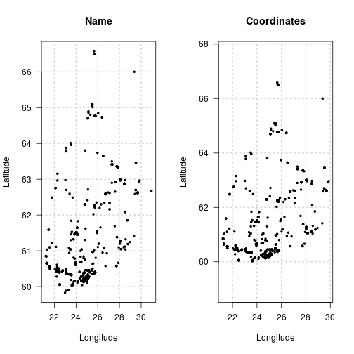

When getting records from FinBIF there are many options for filtering the data
before it is downloaded, saving bandwidth and local post-processing time. For
the full list of filtering options see `?filters`.

## Location
Records can be filtered by the name of a location or by a set of coordinates.

```r
filter1 <- c(country = "Finland")
filter2 <- list(coordinates = list(c(60, 68), c(20, 30), "wgs84"))
par(mfcol = 1:2)
plot(finbif_occurrence(filter = filter1, n = 1000), main = "Name")
plot(finbif_occurrence(filter = filter2, n = 1000), main = "Coordinates")
```



See `?filters` section "Location" for more details

## Time
The event or import date of records can be used to filter occurrence data from
FinBIF. The date filters can be a single year, month or date,

```r
finbif_occurrence(filter = list(date_range_ym = c("2019-12")))
```


<details closed>
<summary> Click to show/hide output. </summary>

```r

#> Records downloaded: 10
#> Records available: 19546
#> A data.frame [10 x 12]
#>               record_id      scientific_name abundance lat_wgs84 lon_wgs84           date_time
#> 1  …KE.921/LGE.627772/…      Pteromys volans  1         61.81362  25.75756 2019-12-31 12:00:00
#> 2         …JX.1054777#4   Sarcosoma globosum  1         60.28506  21.98599 2019-12-31 12:00:00
#> 3         …JX.1054554#7    Exidia glandulosa  1         60.37529  23.16411 2019-12-31 12:00:00
#> 4         …JX.1054930#7     Panellus ringens  1         63.068    21.6902  2019-12-31 12:00:00
#> 5         …JX.1054930#4 Basidioradulum radu…  1         63.068    21.6902  2019-12-31 12:00:00
#> 6         …JX.1054554#4 Hypocreopsis lichen…  10        60.37529  23.16411 2019-12-31 12:00:00
#> 7         …JX.1054621#4           Flammulina  10        60.39362  25.67044 2019-12-31 12:00:00
#> 8   …HR.3211/65241302-U     Pinus sylvestris  1         68.84709  28.33712 2019-12-31 11:00:00
#> 9   …HR.3211/37131235-U  Bombycilla garrulus  1         60.1732   24.9521  2019-12-31 12:00:00
#> 10  …HR.3211/37128031-U  Bombycilla garrulus  1         60.16761  24.94694 2019-12-31 12:00:00
#> ...with 0 more records and 6 more variables:
#> coordinates_uncertainty, any_issues, requires_verification, requires_identification,
#> record_reliability, record_quality

```

</details>
<br>
, or for record events, a range as a character vector or an
[Interval](https://lubridate.tidyverse.org/reference/Interval-class.html)
object.

```r
finbif_occurrence(
  filter = list(date_range_ymd = c("2019-06-01", "2019-12-31"))
)
```


<details closed>
<summary> Click to show/hide output. </summary>

```r

#> Records downloaded: 10
#> Records available: 669879
#> A data.frame [10 x 12]
#>               record_id      scientific_name abundance lat_wgs84 lon_wgs84           date_time
#> 1  …KE.921/LGE.627772/…      Pteromys volans  1         61.81362  25.75756 2019-12-31 12:00:00
#> 2         …JX.1054777#4   Sarcosoma globosum  1         60.28506  21.98599 2019-12-31 12:00:00
#> 3         …JX.1054554#7    Exidia glandulosa  1         60.37529  23.16411 2019-12-31 12:00:00
#> 4         …JX.1054930#7     Panellus ringens  1         63.068    21.6902  2019-12-31 12:00:00
#> 5         …JX.1054930#4 Basidioradulum radu…  1         63.068    21.6902  2019-12-31 12:00:00
#> 6         …JX.1054554#4 Hypocreopsis lichen…  10        60.37529  23.16411 2019-12-31 12:00:00
#> 7         …JX.1054621#4           Flammulina  10        60.39362  25.67044 2019-12-31 12:00:00
#> 8   …HR.3211/65241302-U     Pinus sylvestris  1         68.84709  28.33712 2019-12-31 11:00:00
#> 9   …HR.3211/37131235-U  Bombycilla garrulus  1         60.1732   24.9521  2019-12-31 12:00:00
#> 10  …HR.3211/37128031-U  Bombycilla garrulus  1         60.16761  24.94694 2019-12-31 12:00:00
#> ...with 0 more records and 6 more variables:
#> coordinates_uncertainty, any_issues, requires_verification, requires_identification,
#> record_reliability, record_quality

```

</details>
<br>

Records for a specific season or time-span across all years can also be
requested.

```r
finbif_occurrence(
  filter = list(
    date_range_md = c(begin = "12-21", end = "12-31"),
    date_range_md = c(begin = "01-01", end = "02-20")
  )
)
```


<details closed>
<summary> Click to show/hide output. </summary>

```r

#> Records downloaded: 10
#> Records available: 1598855
#> A data.frame [10 x 12]
#>              record_id     scientific_name abundance lat_wgs84 lon_wgs84           date_time
#> 1  …HR.3211/69860385-U       Magnoliopsida  1         60.30464  25.00083 2021-02-20 12:00:00
#> 2      …JX.1223101#107           Pica pica  8         62.70713  22.20652 2021-02-20 08:20:00
#> 3       …JX.1223101#85    Poecile montanus  3         62.70713  22.20652 2021-02-20 08:20:00
#> 4      …JX.1223101#153 Emberiza citrinella  24        62.70713  22.20652 2021-02-20 08:20:00
#> 5      …JX.1223101#117        Corvus corax  4         62.70713  22.20652 2021-02-20 08:20:00
#> 6       …JX.1223101#61   Dendrocopos major  1         62.70713  22.20652 2021-02-20 08:20:00
#> 7      …JX.1223101#111     Corvus monedula  4         62.70713  22.20652 2021-02-20 08:20:00
#> 8      …JX.1223101#123     Passer montanus  3         62.70713  22.20652 2021-02-20 08:20:00
#> 9      …JX.1223101#149   Pyrrhula pyrrhula  10        62.70713  22.20652 2021-02-20 08:20:00
#> 10      …JX.1223101#93 Cyanistes caeruleus  47        62.70713  22.20652 2021-02-20 08:20:00
#> ...with 0 more records and 6 more variables:
#> coordinates_uncertainty, any_issues, requires_verification, requires_identification,
#> record_reliability, record_quality

```

</details>
<br>

## Data Quality
You can filter occurrence records by indicators of data quality. See `?filters`
section "Quality" for details.

```r
strict <- c(
  collection_quality = "professional", coordinates_uncertainty_max = 1,
  record_quality = "expert_verified"
)
permissive <- list(
  quality_issues = "both",
  record_reliability = c("reliable", "unassessed", "unreliable"),
  record_quality = c(
    "expert_verified", "community_verified", "unassessed", "uncertain",
    "erroneous"
  )
)
c(
  strict     = finbif_occurrence(filter = strict,     count_only = TRUE),
  permissive = finbif_occurrence(filter = permissive, count_only = TRUE)
)
#>     strict permissive 
#>         37   40636542
```

## Collection
The FinBIF database consists of a number of constituent collections. You can
filter by collection with either the `collection` or `not_collection` filters.
Use `finbif_collections()` to see metadata on the FinBIF collections.

```r
finbif_occurrence(
  filter = c(collection = "iNaturalist Suomi Finland"), count_only = TRUE
)
#> [1] 417052
finbif_occurrence(
  filter = c(collection = "Notebook, general observations"), count_only = TRUE
)
#> [1] 1344139
```

## Informal taxonomic groups
You can filter occurrence records based on informal taxonomic groups such as
`Birds` or `Mammals`.

```r
finbif_occurrence(filter = list(informal_groups = c("Birds", "Mammals")))
```


<details closed>
<summary> Click to show/hide output. </summary>

```r

#> Records downloaded: 10
#> Records available: 21117917
#> A data.frame [10 x 12]
#>               record_id      scientific_name abundance lat_wgs84 lon_wgs84           date_time
#> 1  …HR.3211/134012805-U    Microtus agrestis        NA  60.22896  25.08694 2022-09-07 12:00:00
#> 2  …HR.3211/134000236-U Oryctolagus cunicul…        NA  60.15647  24.69299 2022-09-07 12:00:00
#> 3         …JX.1440059#3    Dendrocopos major  1         61.09692  21.76019 2022-09-06 19:50:00
#> 4         …JX.1440058#6               Passer  2         61.07281  21.75856 2022-09-06 19:00:00
#> 5         …JX.1440058#9            Grus grus  1         61.07281  21.75856 2022-09-06 19:00:00
#> 6         …JX.1440058#3      Accipiter nisus  1         61.07281  21.75856 2022-09-06 19:00:00
#> 7        …JX.1440058#12    Carduelis chloris  3         61.07281  21.75856 2022-09-06 19:00:00
#> 8  …HR.3211/133925964-U          Larus canus        NA  60.1      24.9     2022-09-06 12:00:00
#> 9  …HR.3211/133975979-U     Anthus trivialis        NA  60.23348  24.91985 2022-09-06 12:00:00
#> 10 …HR.3211/133975532-U       Sylvia curruca        NA  60.2336   24.91986 2022-09-06 12:00:00
#> ...with 0 more records and 6 more variables:
#> coordinates_uncertainty, any_issues, requires_verification, requires_identification,
#> record_reliability, record_quality

```

</details>
<br>

See `finbif_informal_groups()` for the full list of groups you can filter by.
You can use the same function to see the subgroups that make up a higher
level informal group:

```r
finbif_informal_groups("macrofungi")
#>  ¦--Macrofungi                                                
#>  ¦   ¦--Agaricoid fungi                                       
#>  ¦   ¦--Aphyllophoroid fungi                                  
#>  ¦   ¦   ¦--Cantharelloid fungi                               
#>  ¦   ¦   ¦--Clavarioid fungi                                  
#>  ¦   ¦   ¦--Corticioid fungi                                  
#>  ¦   ¦   ¦--Hydnoid fungi                                     
#>  ¦   ¦   ¦--Jelly fungi, tremelloid fungi                     
#>  ¦   ¦   ¦--Polypores                                         
#>  ¦   ¦   °--Ramarioid fungi                                   
#>  ¦   ¦--Boletoid fungi                                        
#>  ¦   ¦--Cyphelloid fungi                                      
#>  ¦   °--Gastroid fungi, puffballs
```

## Regulatory 
Many records in the FinBIF database include taxa that have one or another
regulatory statuses. See `finbif_metadata("regulatory_status")` for a list of
regulatory statuses and short-codes.

```r
# Search for birds on the EU invasive species list
finbif_occurrence(
  filter = list(informal_groups = "Birds", regulatory_status = "EU_INVSV")
)
```


<details closed>
<summary> Click to show/hide output. </summary>

```r

#> Records downloaded: 10
#> Records available: 469
#> A data.frame [10 x 12]
#>               record_id      scientific_name abundance lat_wgs84 lon_wgs84           date_time
#> 1  …KE.176/62b1ad90d5d…   Oxyura jamaicensis  7         61.66207  23.57706 2022-06-21 12:00:00
#> 2        …JX.1045316#34 Alopochen aegyptiaca  3         52.16081  4.485534 2019-10-23 13:00:00
#> 3        …JX.138840#123 Alopochen aegyptiaca  4         53.36759  6.191796 2018-10-26 11:15:00
#> 4        …JX.139978#214 Alopochen aegyptiaca  6         53.37574  6.207861 2018-10-23 08:30:00
#> 5         …JX.139710#17 Alopochen aegyptiaca  30        52.3399   5.069133 2018-10-22 10:45:00
#> 6         …JX.139645#57 Alopochen aegyptiaca  36        51.74641  4.535283 2018-10-21 13:00:00
#> 7         …JX.139645#10 Alopochen aegyptiaca  3         51.74641  4.535283 2018-10-21 13:00:00
#> 8         …JX.139442#16 Alopochen aegyptiaca  2         51.90871  4.53258  2018-10-20 12:10:00
#> 9      …KE.8_1208123#15 Alopochen aegyptiaca  2         53.19242  5.437417 2017-10-24 11:06:00
#> 10    …KE.8_1208068#101 Alopochen aegyptiaca  20        53.32081  6.192341 2017-10-23 12:15:00
#> ...with 0 more records and 6 more variables:
#> coordinates_uncertainty, any_issues, requires_verification, requires_identification,
#> record_reliability, record_quality

```

</details>
<br>

## IUCN red list
Filtering can be done by [IUCN red list](https://punainenkirja.laji.fi/)
category. See `finbif_metadata("red_list")` for the IUCN red list categories and
their short-codes.

```r
# Search for near threatened mammals
finbif_occurrence(
  filter = list(informal_groups = "Mammals", red_list_status = "NT")
)
```


<details closed>
<summary> Click to show/hide output. </summary>

```r

#> Records downloaded: 10
#> Records available: 2503
#> A data.frame [10 x 12]
#>               record_id      scientific_name abundance lat_wgs84 lon_wgs84           date_time
#> 1  …KE.176/63122fa2d5d… Rangifer tarandus f…  2         64.493    25.417   2022-09-01 12:00:00
#> 2         …JX.1436288#3 Rangifer tarandus f…  1         62.65913  24.56789 2022-08-25 12:00:00
#> 3       …JX.1427444#284 Rangifer tarandus f…  1         64.32297  28.86242 2022-08-21 12:00:00
#> 4       …JX.1427444#293 Rangifer tarandus f…  1         64.43202  28.91627 2022-08-21 12:00:00
#> 5  …HR.3211/131434391-U                 <NA>        NA  60.74312  24.77281 2022-08-19 12:00:00
#> 6  …HR.3211/131366861-U Rangifer tarandus f…        NA  63.9      24.9     2022-08-18 12:00:00
#> 7        …JX.1427444#95 Rangifer tarandus f…        NA  64.07652  29.75366 2022-08-17 12:00:00
#> 8         …JX.1432414#3 Rangifer tarandus f…  3         62.15446  22.18987 2022-08-14 10:00:00
#> 9         …JX.1431845#3 Rangifer tarandus f…  1         63.31183  24.90167 2022-08-11 12:00:00
#> 10        …JX.1430963#3 Rangifer tarandus f…  1         62.29971  24.48758 2022-08-11 06:20:00
#> ...with 0 more records and 6 more variables:
#> coordinates_uncertainty, any_issues, requires_verification, requires_identification,
#> record_reliability, record_quality

```

</details>
<br>

## Habitat type
Many taxa are associated with one or more primary or secondary habitat types
(e.g., forest) or subtypes (e.g., herb-rich alpine birch forests). Use
`finbif_metadata("habitat_type")` to see the habitat types in FinBIF. You can
filter occurrence records based on primary (or primary/secondary) habitat type
or subtype codes. Note that filtering based on habitat is on taxa not on the
location (i.e., filtering records with `primary_habitat = "M"` will only return
records of taxa considered to primarily inhabit forests, yet the locations of
those records may encompass habitats other than forests).

```r
head(finbif_metadata("habitat_type"))
#>   habitat_code habitat_description                               
#> 1 U            ? – Habitat unknown                               
#> 2 I            I – Rural biotopes and cultural habitats          
#> 3 Ih           Ih – wooded pastures, pollard meadows and grazed …
#> 4 Ik           Ik – seminatural moist meadows (excluding shore m…
#> 5 In           In – seminatural dry meadows                      
#> 6 Io           Io – ditches etc.
```

```r
# Search records of taxa for which forests are their primary or secondary
# habitat type
finbif_occurrence(filter = c(primary_secondary_habitat = "M"))
```


<details closed>
<summary> Click to show/hide output. </summary>

```r

#> Records downloaded: 10
#> Records available: 22695106
#> A data.frame [10 x 12]
#>    record_id      scientific_name abundance lat_wgs84 lon_wgs84           date_time
#> 1    …5966#9 Trichaptum fuscovio…  1         65.08865  25.45157 2021-10-05 12:00:00
#> 2    …5966#3  Lycogala epidendrum  1         65.08865  25.45157 2021-10-05 12:00:00
#> 3    …5966#6 Stereum sanguinolen…  1         65.08865  25.45157 2021-10-05 12:00:00
#> 4    …5969#3      Rana temporaria  1         62.48525  21.75467 2021-10-05 12:00:00
#> 5    …5950#3 Exechiopsis fimbria…  1         65.01504  25.52607 2021-10-05 12:00:00
#> 6    …5929#9   Epirrita autumnata  1         62.92172  27.63335 2021-10-05 12:00:00
#> 7    …5929#6  Poecilocampa populi  1         62.92172  27.63335 2021-10-05 12:00:00
#> 8    …5929#3      Xestia c-nigrum  1         62.92172  27.63335 2021-10-05 12:00:00
#> 9    …6006#3  Tricholoma equestre  1         61.59036  21.46508 2021-10-04 12:00:00
#> 10  …6004#12 Agriopis aurantiaria  2         60.14694  24.7522  2021-10-04 12:00:00
#> ...with 0 more records and 6 more variables:
#> coordinates_uncertainty, any_issues, requires_verification, requires_identification,
#> record_reliability, record_quality

```

</details>
<br>

You may further refine habitat based searching using a specific habitat type
qualifier such as "sun-exposed" or "shady". Use
`finbif_metadata("habitat_qualifier")` to see the qualifiers available. To
specify qualifiers use a named list of character vectors where the names are
habitat types or subtypes and the elements of the character vectors are the
qualifier codes.

```r
finbif_metadata("habitat_qualifier")[4:6, ]
#>   qualifier_code qualifier_description                             
#> 4 KA             ka – acidic rocks and boulder fields              
#> 5 KE             ke – intermediate-basic rock outcrops and boulder…
#> 6 P              p – burnt forest areas and other young stages of …
```

```r
# Search records of taxa for which forests with sun-exposure and broadleaved
# deciduous trees are their primary habitat type
finbif_occurrence(filter = list(primary_habitat = list(M = c("PA", "J"))))
```


<details closed>
<summary> Click to show/hide output. </summary>

```r

#> Records downloaded: 10
#> Records available: 123
#> A data.frame [10 x 12]
#>              record_id  scientific_name abundance lat_wgs84 lon_wgs84           date_time
#> 1       …JX.1263703#60 Pammene fasciana  1         60.08841  22.48629 2021-06-22 12:00:00
#> 2      …JX.1256040#165 Pammene fasciana  1         60.08841  22.48629 2021-06-19 12:00:00
#> 3  …HR.3211/53817755-U Pammene fasciana  1         59.90452  23.72726 2020-07-21 12:00:00
#> 4        …JX.1134471#4 Pammene fasciana  2         61.54984  29.50158 2020-06-21 12:00:00
#> 5      …JX.1143718#265 Pammene fasciana  1         60.3754   22.37212 2020-06-10 12:00:00
#> 6      …JX.1012832#367 Pammene fasciana  1         60.00217  23.43591 2019-06-22 12:00:00
#> 7      …JX.1098381#487 Pammene fasciana  1         60.04555  23.31692 2019-06-19 12:00:00
#> 8       …JX.1011605#97 Pammene fasciana  1         60.50396  27.72823 2019-05-30 12:00:00
#> 9       …JX.996622#130 Pammene fasciana  3         60.00217  23.43591 2019-05-08 12:00:00
#> 10      …JX.1103286#13 Pammene fasciana  1         59.90522  23.49645 2018-05-28 12:00:00
#> ...with 0 more records and 6 more variables:
#> coordinates_uncertainty, any_issues, requires_verification, requires_identification,
#> record_reliability, record_quality

```

</details>
<br>

## Status of taxa in Finland
You can restrict the occurrence records by the status of the taxa in Finland.
For example you can request records for only rare species.

```r
finbif_occurrence(filter = c(finnish_occurrence_status = "rare"))
```


<details closed>
<summary> Click to show/hide output. </summary>

```r

#> Records downloaded: 10
#> Records available: 318316
#> A data.frame [10 x 12]
#>              record_id      scientific_name abundance lat_wgs84 lon_wgs84           date_time
#> 1        …JX.1315617#3 Stigmella ruficapit…  1         61.51447  24.0233  2021-10-03 12:00:00
#> 2        …JX.1315617#6 Stigmella ruficapit…  5         61.51447  24.0233  2021-10-03 12:00:00
#> 3        …JX.1315625#3 Ectoedemia turbidel…  10        60.21493  24.86162 2021-10-03 12:00:00
#> 4        …JX.1315620#3 Ectoedemia intimella  1         62.0223   25.6044  2021-10-03 12:00:00
#> 5        …JX.1315390#3 Stigmella assimilel…  1         61.51447  24.0233  2021-10-02 12:00:00
#> 6        …JX.1314937#9 Stigmella glutinosae  1         61.51447  24.0233  2021-10-01 12:00:00
#> 7        …JX.1315138#3 Stigmella filipendu…  3         62.64272  29.63881 2021-10-01 12:00:00
#> 8        …JX.1305550#3 Stigmella myrtillel…  1         61.51447  24.0233  2021-09-30 12:00:00
#> 9        …JX.1315169#3 Ectoedemia intimella  2         61.58965  27.65204 2021-09-30 12:00:00
#> 10 …HR.3211/96782798-U Lyonetia prunifolie…  1         60.35792  24.78564 2021-09-30 12:00:00
#> ...with 0 more records and 6 more variables:
#> coordinates_uncertainty, any_issues, requires_verification, requires_identification,
#> record_reliability, record_quality

```

</details>
<br>
Or, by using the negation of occurrence status, you can request records of birds
excluding those considered vagrants.

```r
finbif_occurrence(
  filter = list(
    informal_groups               = "birds",
    finnish_occurrence_status_neg = sprintf("vagrant_%sregular", c("", "ir"))
  )
)
```


<details closed>
<summary> Click to show/hide output. </summary>

```r

#> Records downloaded: 10
#> Records available: 20779181
#> A data.frame [10 x 12]
#>               record_id     scientific_name abundance lat_wgs84 lon_wgs84           date_time
#> 1         …JX.1440059#3   Dendrocopos major  1         61.09692  21.76019 2022-09-06 19:50:00
#> 2         …JX.1440058#6              Passer  2         61.07281  21.75856 2022-09-06 19:00:00
#> 3         …JX.1440058#9           Grus grus  1         61.07281  21.75856 2022-09-06 19:00:00
#> 4         …JX.1440058#3     Accipiter nisus  1         61.07281  21.75856 2022-09-06 19:00:00
#> 5        …JX.1440058#12   Carduelis chloris  3         61.07281  21.75856 2022-09-06 19:00:00
#> 6  …HR.3211/133925964-U         Larus canus        NA  60.1      24.9     2022-09-06 12:00:00
#> 7  …HR.3211/133975979-U    Anthus trivialis        NA  60.23348  24.91985 2022-09-06 12:00:00
#> 8  …HR.3211/133975532-U      Sylvia curruca        NA  60.2336   24.91986 2022-09-06 12:00:00
#> 9  …HR.3211/133877304-U Garrulus glandarius        NA  61.44345  23.86333 2022-09-06 12:00:00
#> 10 …HR.3211/133974658-U      Turdus iliacus        NA  60.22801  24.91946 2022-09-06 12:00:00
#> ...with 0 more records and 6 more variables:
#> coordinates_uncertainty, any_issues, requires_verification, requires_identification,
#> record_reliability, record_quality

```

</details>
<br>

See `finbif_metadata("finnish_occurrence_status")` for a full list of statuses
and their descriptions.
