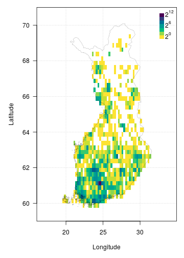

FinBIF aggregates Finnish biodiversity data from multiple sources in a single
open access portal for researchers, citizen scientists, industry and government.
FinBIF allows users of biodiversity information to find, access, combine and 
visualise data on Finnish plants, animals and microorganisms. The `{finbif}`
R package makes the publicly available data in FinBIF easily accessible to
programmers. Biodiversity information is available on taxonomy and taxon
occurrence. Occurrence data can be filtered by taxon, time, location and other
variables. The data accessed are conveniently preformatted for subsequent
analyses.

## Installing the finbif package
You can install the current stable version of `{finbif}` from
[CRAN](https://cran.r-project.org),

```r
install.packages("finbif")
```

You can also install the latest development version of `{finbif}` from
[GitHub](https://github.com),

```r
remotes::install_github("luomus/finbif@dev")
```

## Loading the finbif package

```r
library(finbif)
```

## Getting a FinBIF access token
To use the FinBIF API you must first request and set a personal access token.
You can request an API token to be sent to your email address with the function
`finbif_get_token()`.

```r
finbif_request_token("your@email.com")
```

Copy the access token that was sent to your email and set it as the environment
variable `FINBIF_ACCESS_TOKEN` either for the current session,

```r
Sys.setenv(
  FINBIF_ACCESS_TOKEN = "xtmSOIxjPwq0pOMB1WvcZgFLU9QBklauOlonWl8K5oaLIx8RniJLrvcJU4v9H7Et"
)
# Note: the above is not a real access token. Do not try using it.
```
, or by adding it to a `Renviron` startup file (see
[here](https://rviews.rstudio.com/2017/04/19/r-for-enterprise-understanding-r-s-startup/)
for details).

## Working with taxa
You can check to see if a taxon exists in the FinBIF database.

```r
finbif_check_taxa("Ursus arctos")
#> [Ursus arctos] ID: MX.47348
```

If the taxon is in the FinBIF database its unique ID is returned. When a taxon
is not in the FinBIF database it is reported as "not found" and for that taxa
the list element is `NA`.

```r
(taxa <- finbif_check_taxa(c("Ursus arctos", "Moomin")))
#> [Ursus arctos] ID: MX.47348
#> [Moomin      ] Not found
taxa[[1]]
#> Ursus arctos 
#>   "MX.47348"
taxa[[2]]
#> Moomin 
#>     NA
```

You can also specify the taxonomic rank when searching FinBIF and the search
will be limited to the specified rank.

```r
finbif_check_taxa(list(species = c("Ursus arctos", "Ursus"), genus = "Ursus"))
#> [species: Ursus arctos] ID: MX.47348
#> [species: Ursus       ] Not found
#> [genus:   Ursus       ] ID: MX.51311
```

The function `finbif_taxa()` can be used for a more general search for taxa in
the FinBIF database. Searches can be `exact`, `partial` or `likely` (fuzzy
matching). Information for a single taxon is returned when using exact or fuzzy
matching, but multiple taxa, up to a limit, `n`, may be returned when using
partial matching.

```r
birch_search <- finbif_taxa("Betula pendula", 2, "partial")
birch_search$content
```


<details closed>
<summary> Click to show/hide output. </summary>

```r

#> [[1]]
#> [[1]]$matchingName
#> [1] "Betula pendula var. pendula"
#> 
#> [[1]]$nameType
#> [1] "MX.scientificName"
#> 
#> [[1]]$id
#> [1] "MX.37994"
#> 
#> [[1]]$scientificName
#> [1] "Betula pendula var. pendula"
#> 
#> [[1]]$taxonRank
#> [1] "MX.variety"
#> 
#> [[1]]$cursiveName
#> [1] TRUE
#> 
#> [[1]]$finnish
#> [1] TRUE
#> 
#> [[1]]$species
#> [1] TRUE
#> 
#> [[1]]$vernacularName
#> [[1]]$vernacularName$sv
#> [1] "vanlig vårtbjörk"
#> 
#> [[1]]$vernacularName$fi
#> [1] "vihtakoivu"
#> 
#> 
#> [[1]]$informalGroups
#> [[1]]$informalGroups[[1]]
#> [[1]]$informalGroups[[1]]$id
#> [1] "MVL.343"
#> 
#> [[1]]$informalGroups[[1]]$name
#> [[1]]$informalGroups[[1]]$name$fi
#> [1] "Putkilokasvit"
#> 
#> [[1]]$informalGroups[[1]]$name$sv
#> [1] "Kärlväxter"
#> 
#> [[1]]$informalGroups[[1]]$name$en
#> [1] "Vascular plants"
#> 
#> 
#> 
#> 
#> [[1]]$type
#> [1] "partialMatches"
#> 
#> 
#> [[2]]
#> [[2]]$matchingName
#> [1] "Betula nana × pendula"
#> 
#> [[2]]$nameType
#> [1] "MX.scientificName"
#> 
#> [[2]]$id
#> [1] "MX.38005"
#> 
#> [[2]]$scientificName
#> [1] "Betula nana × pendula"
#> 
#> [[2]]$taxonRank
#> [1] "MX.infragenericHybrid"
#> 
#> [[2]]$cursiveName
#> [1] TRUE
#> 
#> [[2]]$finnish
#> [1] TRUE
#> 
#> [[2]]$species
#> [1] TRUE
#> 
#> [[2]]$vernacularName
#> named list()
#> 
#> [[2]]$informalGroups
#> [[2]]$informalGroups[[1]]
#> [[2]]$informalGroups[[1]]$id
#> [1] "MVL.343"
#> 
#> [[2]]$informalGroups[[1]]$name
#> [[2]]$informalGroups[[1]]$name$fi
#> [1] "Putkilokasvit"
#> 
#> [[2]]$informalGroups[[1]]$name$sv
#> [1] "Kärlväxter"
#> 
#> [[2]]$informalGroups[[1]]$name$en
#> [1] "Vascular plants"
#> 
#> 
#> 
#> 
#> [[2]]$type
#> [1] "partialMatches"
#> 
#> 

```

</details>
<br>

## Getting occurrence data
You can download occurrence data from the FinBIF database as a `data.frame` with
the `finbif_occurrence()` function.

```r
finbif_occurrence("Cygnus cygnus", n = 100)
#> Records downloaded: 100
#> Records available: 71156
#> A data.frame [100 x 12]
#>              record_id scientific_name abundance lat_wgs84 lon_wgs84           date_time
#> 1       …JX.1315699#12   Cygnus cygnus  3         60.56739  21.57188 2021-10-03 12:00:00
#> 2        …JX.1315624#7   Cygnus cygnus  2         63.77814  23.07286 2021-10-03 12:00:00
#> 3       …JX.1315190#24   Cygnus cygnus  2         60.42794  22.20052 2021-10-02 12:00:00
#> 4  …HR.3211/96901650-U   Cygnus cygnus  1         60.20356  25.18139 2021-10-02 12:00:00
#> 5  …HR.3211/96886383-U   Cygnus cygnus  1         62.91891  28.18733 2021-10-02 12:00:00
#> 6  …HR.3211/96873463-U   Cygnus cygnus  1         61.55599  25.95057 2021-10-02 12:00:00
#> 7       …JX.1315449#15   Cygnus cygnus  6         61.32296  28.56814 2021-10-02 10:40:00
#> 8       …JX.1315165#30   Cygnus cygnus  2         61.10535  21.55759 2021-10-02 08:25:00
#> 9        …JX.1296318#3   Cygnus cygnus  26        60.83174  26.44824 2021-09-30 12:00:00
#> 10 …HR.3211/96581760-U   Cygnus cygnus  1         61.46442  23.65117 2021-09-29 12:00:00
#> ...with 90 more records and 6 more variables:
#> coordinates_uncertainty, any_issues, requires_verification, requires_identification,
#> record_reliability, record_quality
```

You can search for multiple taxa at once and filter the records with the
`filter` argument.

```r
finbif_occurrence(
  "Cygnus cygnus", 
  "Cygnus olor",
  filter = list(coordinates_uncertainty_max = 100)
)
```


<details closed>
<summary> Click to show/hide output. </summary>

```r

#> Records downloaded: 10
#> Records available: 26352
#> A data.frame [10 x 12]
#>              record_id scientific_name abundance lat_wgs84 lon_wgs84           date_time
#> 1        …JX.1315856#9     Cygnus olor  8         60.42794  22.20052 2021-10-04 12:00:00
#> 2       …JX.1315724#21     Cygnus olor  6         60.44906  22.76845 2021-10-03 12:00:00
#> 3       …JX.1315701#36     Cygnus olor  8         60.42794  22.20052 2021-10-03 12:00:00
#> 4       …JX.1315699#24     Cygnus olor  8         60.56739  21.57188 2021-10-03 12:00:00
#> 5       …JX.1315699#12   Cygnus cygnus  3         60.56739  21.57188 2021-10-03 12:00:00
#> 6        …JX.1315624#7   Cygnus cygnus  2         63.77814  23.07286 2021-10-03 12:00:00
#> 7       …JX.1315190#24   Cygnus cygnus  2         60.42794  22.20052 2021-10-02 12:00:00
#> 8  …HR.3211/96901650-U   Cygnus cygnus  1         60.20356  25.18139 2021-10-02 12:00:00
#> 9  …HR.3211/96873463-U   Cygnus cygnus  1         61.55599  25.95057 2021-10-02 12:00:00
#> 10 …HR.3211/96867853-U     Cygnus olor  1         60.12642  24.73924 2021-10-02 12:00:00
#> ...with 0 more records and 6 more variables:
#> coordinates_uncertainty, any_issues, requires_verification, requires_identification,
#> record_reliability, record_quality

```

</details>
<br>

See `?filters` and `vignette("v05_filtering")` for more details on filtering
FinBIF records.

### Random sampling
It is possible to request a random sample of records instead of the last `n`
records (or records ordered by some other variable).

```r
finbif_occurrence("Birds", sample = TRUE)
```


<details closed>
<summary> Click to show/hide output. </summary>

```r

#> Records downloaded: 10
#> Records available: 19686186
#> A data.frame [10 x 12]
#>               record_id      scientific_name abundance lat_wgs84 lon_wgs84           date_time
#> 1         …MHU.29129341     Sturnus vulgaris  1         60.52698  21.62055 2010-05-01 12:00:00
#> 2           …JX.93743#5 Corvus corone cornix  46        62.14011  24.59989 1969-12-26 09:00:00
#> 3   …KE.67/3168115#Unit     Numenius arquata  1         63.15     27.83333 2008-06-06 13:00:00
#> 4  …KE.67/11186470#Unit  Emberiza citrinella  1         62.75622  26.6937  2017-01-17 14:00:00
#> 5       …JX.1029925#296    Turdus philomelos  1         61.43368  28.6004  1998-06-05 05:02:00
#> 6   …KE.67/3446629#Unit          Parus major  1         60.33031  25.20922 2011-03-27 17:00:00
#> 7   …KE.67/7662953#Unit   Sylvia atricapilla  1         59.83333  19.93333 1976-09-07 12:00:00
#> 8   …KE.67/7531888#Unit   Prunella modularis  1         59.83333  19.93333 1993-04-26 07:00:00
#> 9   …KE.383/1607#UNIT76 Lophophanes cristat…  3         59.9815   24.39953 1996-12-16 12:00:00
#> 10      …JX.1025345#261    Fringilla coelebs  1         62.29238  24.35626 2009-06-08 03:30:00
#> ...with 0 more records and 6 more variables:
#> coordinates_uncertainty, any_issues, requires_verification, requires_identification,
#> record_reliability, record_quality

```

</details>
<br>

## Plotting occurrence data
The `{finbif}` package has a number of inbuilt functions for plotting (see e.g.,
`breaks_xy()` and `hist_xy()`). There is also an inbuilt dataset that can be
used to plot the border of Finland (`?finland_map`). Together these utilities
can be used to plot occurrences after they have been downloaded from FinBIF. For
example, the following can be used to plot the density of Eurasian Jay
occurrences from Finland.

<details closed>
<summary><span title=''>Click to show/hide code.</span></summary>

```r
# Download all the occurrences of Eurasian Jay in Finland
# that have coordinates accurate to at least 100m
jays <- finbif_occurrence(
  taxa   = "Eurasian Jay",
  filter = c(
    coordinates_uncertainty_max = 100,
    country                     = "Finland"
  ),
  n      = 2e4,
  quiet  = TRUE
)

# Compute the density of occurrences in 1/4 degree cells and plot as a heatmap
with(
  data = c(jays, finland_map),
  expr = {
    par(mar = c(5, 5, 1, 1), las = 1)
    # compute a 2d histogram from the occurrences
    breaks  <- breaks_xy(bbox, .25) # breakpoints every 1/4 of a degree
    density <- hist_xy(xy = list(lon_wgs84, lat_wgs84), breaks)
    # plot the histogram as a heatmap
    image(density,
          asp    = 2.4,
          breaks = 2^seq(0, 12), # breakpoints for the gridcell colours
          col    = hcl.colors(12, rev = TRUE),
          xlab   = "Longitude",
          ylab   = "Latitude",
          panel.first = grid())
    legend("topright",
           inset  = c(0, .01),
           legend = expression(2^12, "", "", 2^6, "", "", 2^0),
           fill   = hcl.colors(7),
           border = NA,
           bty    = "n",
           adj    = c(0, 0.25), 
           x.intersp = .2,
           y.intersp = .5)
    # add the Finnish border
    polygon(x = vertices, lwd = .2)
  }
)
```
</details>


## Caching
By default `{finbif}` uses local caching for repeated API requests. This can be
turned on or off on a per request or session basis. See `?caching` for details.
