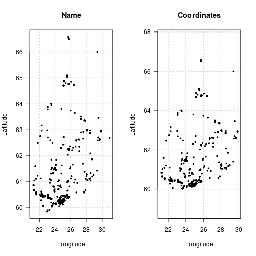

When getting records from FinBIF there are many options for filtering the data
before it is downloaded, saving bandwidth and local post-processing time. For
the full list of filtering options see `?filters`.

## Location
Records can be filtered by the name of a location or by a set of coordinates.

```r
filter1 <- c(country = "Finland")
filter2 <- list(coordinates = list(c(60, 68), c(20, 30), "wgs84"))
par(mfcol = 1:2)
plot(finbif_occurrence(filter = filter1, n = 1000), main = "Name")
plot(finbif_occurrence(filter = filter2, n = 1000), main = "Coordinates")
```



See `?filters` section "Location" for more details

## Time
The event or import date of records can be used to filter occurrence data from
FinBIF. The date filters can be a single year, month or date,

```r
finbif_occurrence(filter = list(date_range_ym = c("2019-12")))
```


<details closed>
<summary> Click to show/hide output. </summary>

```r

#> Records downloaded: 10
#> Records available: 9305
#> A data.frame [10 x 12]
#>               record_id      scientific_name abundance lat_wgs84 lon_wgs84           date_time
#> 1  mus.utu.fi/MY.73114…  Nowellia curvifolia  1         60.38972  22.52086 2019-12-31 12:00:00
#> 2  mus.utu.fi/MY.72933…         Viscum album  1         60.4638   22.3343  2019-12-31 12:00:00
#> 3  tun.fi/HR.3211/3713…  Bombycilla garrulus  1         60.1732   24.9521  2019-12-31 12:00:00
#> 4  tun.fi/HR.3211/3712… Columba livia domes…  1         60.16758  24.95355 2019-12-31 12:00:00
#> 5  tun.fi/HR.3211/3712… Columba livia domes…  1         60.16748  24.94759 2019-12-31 12:00:00
#> 6  tun.fi/HR.3211/3713…  Cyanistes caeruleus  1         60.16763  24.94723 2019-12-31 12:00:00
#> 7  tun.fi/HR.3211/3712…    Passer domesticus  1         60.16751  24.95001 2019-12-31 12:00:00
#> 8  tun.fi/HR.3211/3712…    Passer domesticus  1         60.16958  24.95622 2019-12-31 12:00:00
#> 9  tun.fi/HR.3211/3712…    Passer domesticus  1         60.168    24.9527  2019-12-31 12:00:00
#> 10 tun.fi/HR.3211/3713…    Perca fluviatilis  1         66.04649  26.90589 2019-12-31 12:00:00
#> ...with 0 more records and 6 more variables:
#> coordinates_uncertainty, any_issues, requires_verification, requires_identification,
#> record_reliability, record_quality

```

</details>
<br>
, or for record events, a range as a character vector or an
[Interval](https://lubridate.tidyverse.org/reference/Interval-class.html)
object.

```r
finbif_occurrence(
  filter = list(date_range_ymd = c("2019-06-01", "2019-12-31"))
)
```


<details closed>
<summary> Click to show/hide output. </summary>

```r

#> Records downloaded: 10
#> Records available: 408296
#> A data.frame [10 x 12]
#>               record_id      scientific_name abundance lat_wgs84 lon_wgs84           date_time
#> 1  mus.utu.fi/MY.73114…  Nowellia curvifolia  1         60.38972  22.52086 2019-12-31 12:00:00
#> 2  mus.utu.fi/MY.72933…         Viscum album  1         60.4638   22.3343  2019-12-31 12:00:00
#> 3  tun.fi/HR.3211/3713…  Bombycilla garrulus  1         60.1732   24.9521  2019-12-31 12:00:00
#> 4  tun.fi/HR.3211/3712… Columba livia domes…  1         60.16758  24.95355 2019-12-31 12:00:00
#> 5  tun.fi/HR.3211/3712… Columba livia domes…  1         60.16748  24.94759 2019-12-31 12:00:00
#> 6  tun.fi/HR.3211/3713…  Cyanistes caeruleus  1         60.16763  24.94723 2019-12-31 12:00:00
#> 7  tun.fi/HR.3211/3712…    Passer domesticus  1         60.16751  24.95001 2019-12-31 12:00:00
#> 8  tun.fi/HR.3211/3712…    Passer domesticus  1         60.16958  24.95622 2019-12-31 12:00:00
#> 9  tun.fi/HR.3211/3712…    Passer domesticus  1         60.168    24.9527  2019-12-31 12:00:00
#> 10 tun.fi/HR.3211/3713…    Perca fluviatilis  1         66.04649  26.90589 2019-12-31 12:00:00
#> ...with 0 more records and 6 more variables:
#> coordinates_uncertainty, any_issues, requires_verification, requires_identification,
#> record_reliability, record_quality

```

</details>
<br>

Records for a specific season or time-span across all years can also be
requested.

```r
finbif_occurrence(
  filter = list(
    date_range_md = c(begin = "12-21", end = "12-31"),
    date_range_md = c(begin = "01-01", end = "02-20")
  )
)
```


<details closed>
<summary> Click to show/hide output. </summary>

```r

#> Records downloaded: 10
#> Records available: 1495416
#> A data.frame [10 x 12]
#>               record_id      scientific_name abundance lat_wgs84 lon_wgs84           date_time
#> 1  KE.176/5e6d4dea2d0e…        Cygnus cygnus  1         61.437    23.031   2020-02-20 12:00:00
#> 2    HR.3211/38879545-U        Arctoparmelia  1         63.66888  22.54659 2020-02-20 12:00:00
#> 3    HR.3211/38883010-U Arctostaphylos uva-…  1         63.66254  22.54102 2020-02-20 12:00:00
#> 4    HR.3211/38879685-U Diploschistes scrup…  1         63.6679   22.54609 2020-02-20 12:00:00
#> 5    HR.3211/38883029-U      Empetrum nigrum  1         63.66272  22.54134 2020-02-20 12:00:00
#> 6    HR.3211/38880672-U   Juniperus communis  1         63.66396  22.55074 2020-02-20 12:00:00
#> 7    HR.3211/38879433-U      Lecanoromycetes  1         63.66931  22.54812 2020-02-20 12:00:00
#> 8    HR.3211/38879561-U      Lecanoromycetes  1         63.66892  22.54648 2020-02-20 12:00:00
#> 9    HR.3211/38879560-U      Lecanoromycetes  1         63.66892  22.54653 2020-02-20 12:00:00
#> 10   HR.3211/38879691-U      Lecanoromycetes  1         63.66788  22.54607 2020-02-20 12:00:00
#> ...with 0 more records and 6 more variables:
#> coordinates_uncertainty, any_issues, requires_verification, requires_identification,
#> record_reliability, record_quality

```

</details>
<br>

## Data Quality
You can filter occurrence records by indicators of data quality. See `?filters`
section "Quality" for details.

```r
strict <- c(
  collection_quality = "professional", coordinates_uncertainty_max = 1,
  record_quality = "expert_verified"
)
permissive <- list(
  quality_issues = "both",
  record_reliability = c("reliable", "unassessed", "unreliable"),
  record_quality = c(
    "expert_verified", "community_verified", "unassessed", "uncertain",
    "erroneous"
  )
)
c(
  strict     = finbif_occurrence(filter = strict,     count_only = TRUE),
  permissive = finbif_occurrence(filter = permissive, count_only = TRUE)
)
#>     strict permissive 
#>         14   36095576
```

## Collection
The FinBIF database consists of a number of constituent collections. You can
filter by collection with either the `collection` or `not_collection` filters.
Use `finbif_collections()` to see metadata on the FinBIF collections.

```r
finbif_occurrence(
  filter = c(collection = "iNaturalist"), count_only = TRUE
)
#> [1] 20463
finbif_occurrence(
  filter = c(collection = "Notebook, general observations"), count_only = TRUE
)
#> [1] 730369
```

## Informal taxonomic groups
You can filter occurrence records based on informal taxonomic groups such as
`Birds` or `Mammals`.

```r
finbif_occurrence(filter = list(informal_group = c("Birds", "Mammals")))
```


<details closed>
<summary> Click to show/hide output. </summary>

```r

#> Records downloaded: 10
#> Records available: 18004003
#> A data.frame [10 x 12]
#>               record_id     scientific_name abundance lat_wgs84 lon_wgs84           date_time
#> 1  KE.176/5e9079b42d0e…      Turdus iliacus  1         65.5677   24.44429 2020-04-21 12:00:00
#> 2  KE.176/5e9079b42d0e…   Falco tinnunculus  1         65.5677   24.44429 2020-04-21 12:00:00
#> 3        JX.1110587#148 Phasianus colchicus  1         60.4088   22.20608 2020-04-21 12:00:00
#> 4         JX.1110587#82           Pica pica  7         60.4088   22.20608 2020-04-21 12:00:00
#> 5        JX.1110587#121       Ardea cinerea  1         60.4088   22.20608 2020-04-21 12:00:00
#> 6        JX.1110587#112    Larus argentatus  3         60.4088   22.20608 2020-04-21 12:00:00
#> 7        JX.1110587#115         Picus canus  1         60.4088   22.20608 2020-04-21 12:00:00
#> 8        JX.1110587#133   Linaria cannabina  2         60.4088   22.20608 2020-04-21 12:00:00
#> 9        JX.1110587#106    Mergus merganser  2         60.4088   22.20608 2020-04-21 12:00:00
#> 10       JX.1110587#151         Larus canus  2         60.4088   22.20608 2020-04-21 12:00:00
#> ...with 0 more records and 6 more variables:
#> coordinates_uncertainty, any_issues, requires_verification, requires_identification,
#> record_reliability, record_quality

```

</details>
<br>

See `finbif_informal_groups()` for the full list of groups you can filter by.
You can use the same function to see the subgroups that make up a higher
level informal group:

```r
finbif_informal_groups("macrofungi")
#>  ¦--Macrofungi                                                
#>  ¦   ¦--Agaricoid fungi                                       
#>  ¦   ¦--Aphyllophoroid fungi                                  
#>  ¦   ¦   ¦--Cantharelloid fungi                               
#>  ¦   ¦   ¦--Clavarioid fungi                                  
#>  ¦   ¦   ¦--Corticioid fungi                                  
#>  ¦   ¦   ¦--Hydnoid fungi                                     
#>  ¦   ¦   ¦--Jelly fungi, tremelloid fungi                     
#>  ¦   ¦   ¦--Polypores                                         
#>  ¦   ¦   °--Ramarioid fungi                                   
#>  ¦   ¦--Boletoid fungi                                        
#>  ¦   ¦--Cyphelloid fungi                                      
#>  ¦   °--Gastroid fungi, puffballs
```

## Administrative status
Many records in the FinBIF database include taxa that have one or another
administrative statuses. See `finbif_metadata("admin_status")` for a list of
administrative statuses and short-codes.

```r
# Search for birds on the EU invasive species list
finbif_occurrence(
  filter = list(informal_group = "Birds", administrative_status = "EU_INVSV")
)
```


<details closed>
<summary> Click to show/hide output. </summary>

```r

#> Records downloaded: 10
#> Records available: 437
#> A data.frame [10 x 12]
#>           record_id      scientific_name abundance lat_wgs84 lon_wgs84           date_time
#> 1     JX.1045316#34 Alopochen aegyptiaca  3         52.16081  4.485534 2019-10-23 13:00:00
#> 2     JX.138840#123 Alopochen aegyptiaca  4         53.36759  6.191796 2018-10-26 11:15:00
#> 3     JX.139978#214 Alopochen aegyptiaca  6         53.37574  6.207861 2018-10-23 08:30:00
#> 4      JX.139710#17 Alopochen aegyptiaca  30        52.3399   5.069133 2018-10-22 10:45:00
#> 5      JX.139645#57 Alopochen aegyptiaca  36        51.74641  4.535283 2018-10-21 13:00:00
#> 6      JX.139645#10 Alopochen aegyptiaca  3         51.74641  4.535283 2018-10-21 13:00:00
#> 7      JX.139442#16 Alopochen aegyptiaca  2         51.90871  4.53258  2018-10-20 12:10:00
#> 8   KE.8_1208123#15 Alopochen aegyptiaca  2         53.19242  5.437417 2017-10-24 11:06:00
#> 9  KE.8_1208068#101 Alopochen aegyptiaca  20        53.32081  6.192341 2017-10-23 12:15:00
#> 10  KE.8_1208068#89 Alopochen aegyptiaca  5         53.32081  6.192341 2017-10-23 12:15:00
#> ...with 0 more records and 6 more variables:
#> coordinates_uncertainty, any_issues, requires_verification, requires_identification,
#> record_reliability, record_quality

```

</details>
<br>

## IUCN red list
Filtering can be done by [IUCN red list](https://punainenkirja.laji.fi/)
category. See `finbif_metadata("red_list")` for the IUCN red list categories and
their short-codes.

```r
# Search for near threatened mammals
finbif_occurrence(
  filter = list(informal_group = "Mammals", red_list_status = "NT")
)
```


<details closed>
<summary> Click to show/hide output. </summary>

```r

#> Records downloaded: 10
#> Records available: 1658
#> A data.frame [10 x 12]
#>     record_id      scientific_name abundance lat_wgs84 lon_wgs84           date_time
#> 1    105583#7 Rangifer tarandus f…  7         63.11867  24.12289 2020-03-28 12:00:00
#> 2    102127#4 Pusa hispida botnica  1         64.66837  24.40488 2020-03-07 12:00:00
#> 3    100490#3 Rangifer tarandus f…  5         63.83774  29.16123 2020-02-29 09:18:00
#> 4  046837#113 Rangifer tarandus f…  4         64.42648  29.11431 2019-10-20 12:00:00
#> 5    055497#7 Rangifer tarandus f…  1         64.09919  29.40356 2019-09-23 12:00:00
#> 6  036556#322 Rangifer tarandus f…  1         63.79309  29.5108  2019-09-13 12:00:00
#> 7  035179#144 Rangifer tarandus f…  1         63.93649  29.59252 2019-07-26 12:00:00
#> 8    018572#4 Rangifer tarandus f…  2         63.27123  25.35634 2019-06-28 12:00:00
#> 9    018571#4 Rangifer tarandus f…  1         63.26554  25.36645 2019-06-28 12:00:00
#> 10   008788#4 Rangifer tarandus f…  4         63.03293  24.32905 2019-06-13 12:00:00
#> ...with 0 more records and 6 more variables:
#> coordinates_uncertainty, any_issues, requires_verification, requires_identification,
#> record_reliability, record_quality

```

</details>
<br>

## Habitat type
Many taxa are associated with one or more primary or secondary habitat types
(e.g., forest) or subtypes (e.g., herb-rich alpine birch forests). Use
`finbif_metadata("habitat_types")` to see the habitat types in FinBIF. You can
filter occurrence records based on primary (or primary/secondary) habitat type
or subtype codes. Note that filtering based on habitat is on taxa not on the
location (i.e., filtering records with `primary_habitat = "M"` will only return
records of taxa considered to primarily inhabit forests, yet the locations of
those records may encompass habitats other than forests).

```r
head(finbif_metadata("habitat_types"))
#>   habitat_name                              habitat_code
#> 1 Forests                                   M           
#> 2 Heath forests                             MK          
#> 3 Sub-xeric, xeric and barren heath forests MKK         
#> 4 Mesic and herb-rich heath forests         MKT         
#> 5 Herb-rich forests (also spruce-dominated) ML          
#> 6 Dry and mesic herb-rich forests           MLT
```

```r
# Search records of taxa for which forests are their primary or secondary
# habitat type
finbif_occurrence(filter = c(primary_secondary_habitat = "M"))
```


<details closed>
<summary> Click to show/hide output. </summary>

```r

#> Records downloaded: 10
#> Records available: 19741767
#> A data.frame [10 x 12]
#>               record_id      scientific_name abundance lat_wgs84 lon_wgs84           date_time
#> 1         JX.1110576#13            Aglais io  1         62.23735  27.42594 2020-04-21 12:00:00
#> 2          JX.1110576#4 Archiearis partheni…  6         62.23735  27.42594 2020-04-21 12:00:00
#> 3          JX.1110576#7    Gonepteryx rhamni  7         62.23735  27.42594 2020-04-21 12:00:00
#> 4         JX.1110576#10    Polygonia c-album  2         62.23735  27.42594 2020-04-21 12:00:00
#> 5  KE.176/5e9079b42d0e…       Aglais urticae  1         65.5677   24.44429 2020-04-21 12:00:00
#> 6  KE.176/5e9079b42d0e…       Turdus iliacus  1         65.5677   24.44429 2020-04-21 12:00:00
#> 7          JX.1110588#7            Aglais io  2         63.13815  21.56879 2020-04-21 12:00:00
#> 8          JX.1110588#4       Aglais urticae  6         63.13815  21.56879 2020-04-21 12:00:00
#> 9         JX.1110588#10    Nymphalis antiopa  1         63.13815  21.56879 2020-04-21 12:00:00
#> 10 KE.176/5e5bb8932d0e…       Aglais urticae  1         62.94     26.794   2020-04-21 12:00:00
#> ...with 0 more records and 6 more variables:
#> coordinates_uncertainty, any_issues, requires_verification, requires_identification,
#> record_reliability, record_quality

```

</details>
<br>

You may further refine habitat based searching using a specific habitat type
qualifier such as "sun-exposed" or "shady". Use
`finbif_metadata("habitat_qualifiers")` to see the qualifiers available. To
specify qualifiers use a named list of character vectors where the names are
habitat types or subtypes and the elements of the character vectors are the
qualifier codes.

```r
finbif_metadata("habitat_qualifiers")[4:6, ]
#>   qualifier_name                      qualifier_code
#> 4 Broadleaved deciduous trees present J             
#> 5 Sun-exposed                         PA            
#> 6 Shady                               VA
```

```r
# Search records of taxa for which forests with sun-exposure and broadleaved
# deciduous trees are their primary habitat type
finbif_occurrence(filter = list(primary_habitat = list(M = c("PA", "J"))))
```


<details closed>
<summary> Click to show/hide output. </summary>

```r

#> Records downloaded: 10
#> Records available: 107
#> A data.frame [10 x 12]
#>      record_id  scientific_name abundance lat_wgs84 lon_wgs84           date_time
#> 1  1012832#367 Pammene fasciana  1         60.00217  23.43591 2019-06-22 12:00:00
#> 2  1098381#487 Pammene fasciana  1         60.04555  23.31692 2019-06-19 12:00:00
#> 3   1011605#97 Pammene fasciana  1         60.50396  27.72823 2019-05-30 12:00:00
#> 4   996622#130 Pammene fasciana  3         60.00217  23.43591 2019-05-08 12:00:00
#> 5   1103286#13 Pammene fasciana  1         59.90522  23.49645 2018-05-28 12:00:00
#> 6   1011998#37 Pammene fasciana  1         59.9602   20.99521 2017-09-20 12:00:00
#> 7     155516#2 Pammene fasciana  2         60.35244  19.83238 2017-08-03 12:00:00
#> 8     155516#6 Pammene fasciana  1         60.35244  19.83238 2017-08-03 12:00:00
#> 9     155515#9 Pammene fasciana  1         60.35244  19.83238 2017-08-02 12:00:00
#> 10   161553#44 Pammene fasciana  1         60.21166  24.90204 2017-07-31 12:00:00
#> ...with 0 more records and 6 more variables:
#> coordinates_uncertainty, any_issues, requires_verification, requires_identification,
#> record_reliability, record_quality

```

</details>
<br>

## Status of taxa in Finland
You can restrict the occurrence records by the status of the taxa in Finland.
For example you can request records for only rare species.

```r
finbif_occurrence(filter = c(finnish_occurrence_status = "rare"))
```


<details closed>
<summary> Click to show/hide output. </summary>

```r

#> Records downloaded: 10
#> Records available: 261222
#> A data.frame [10 x 12]
#>             record_id      scientific_name abundance lat_wgs84 lon_wgs84           date_time
#> 1       JX.1110435#22  Conistra rubiginosa  8         60.05748  22.49088 2020-04-21 12:00:00
#> 2        JX.1110435#4 Eriogaster lanestris  2         60.05748  22.49088 2020-04-21 12:00:00
#> 3       JX.1110311#52      Acleris umbrana  1         63.00538  28.04969 2020-04-20 12:00:00
#> 4       JX.1110294#25     Stigmella aceris  1         60.21154  24.9021  2020-04-19 12:00:00
#> 5        JX.1110347#4     Archiearis notha  2         60.25712  24.73908 2020-04-19 12:00:00
#> 6        JX.1110183#7 Rhigognostis schmal…  1         61.51447  24.0233  2020-04-19 12:00:00
#> 7        JX.1110208#4   Ethmia bipunctella  1         60.44842  26.02492 2020-04-19 22:00:00
#> 8        JX.1110178#4 Eriogaster lanestris  1         60.05748  22.49088 2020-04-19 12:00:00
#> 9       JX.1109943#13  Grynocharis oblonga  1         59.98883  24.43653 2020-04-13 12:00:00
#> 10 HR.3211/41981726-U Otiorhynchus singul…  1         60.22261  24.96595 2020-04-12 12:00:00
#> ...with 0 more records and 6 more variables:
#> coordinates_uncertainty, any_issues, requires_verification, requires_identification,
#> record_reliability, record_quality

```

</details>
<br>
Or, by using the negation of occurrence status, you can request records of birds
excluding those considered vagrants.

```r
finbif_occurrence(
  filter = list(
    informal_group                = "birds",
    finnish_occurrence_status_neg = sprintf("vagrant_%sregular", c("", "ir"))
  )
)
```


<details closed>
<summary> Click to show/hide output. </summary>

```r

#> Records downloaded: 10
#> Records available: 17823645
#> A data.frame [10 x 12]
#>               record_id     scientific_name abundance lat_wgs84 lon_wgs84           date_time
#> 1  KE.176/5e9079b42d0e…      Turdus iliacus  1         65.5677   24.44429 2020-04-21 12:00:00
#> 2  KE.176/5e9079b42d0e…   Falco tinnunculus  1         65.5677   24.44429 2020-04-21 12:00:00
#> 3        JX.1110587#148 Phasianus colchicus  1         60.4088   22.20608 2020-04-21 12:00:00
#> 4         JX.1110587#82           Pica pica  7         60.4088   22.20608 2020-04-21 12:00:00
#> 5        JX.1110587#121       Ardea cinerea  1         60.4088   22.20608 2020-04-21 12:00:00
#> 6        JX.1110587#112    Larus argentatus  3         60.4088   22.20608 2020-04-21 12:00:00
#> 7        JX.1110587#115         Picus canus  1         60.4088   22.20608 2020-04-21 12:00:00
#> 8        JX.1110587#133   Linaria cannabina  2         60.4088   22.20608 2020-04-21 12:00:00
#> 9        JX.1110587#106    Mergus merganser  2         60.4088   22.20608 2020-04-21 12:00:00
#> 10       JX.1110587#151         Larus canus  2         60.4088   22.20608 2020-04-21 12:00:00
#> ...with 0 more records and 6 more variables:
#> coordinates_uncertainty, any_issues, requires_verification, requires_identification,
#> record_reliability, record_quality

```

</details>
<br>

See `finbif_metadata("finnish_occurrence_status")` for a full list of statuses
and their descriptions.
