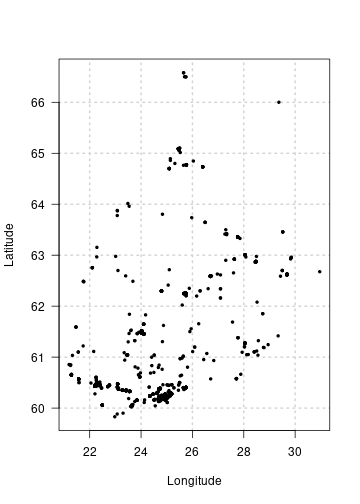
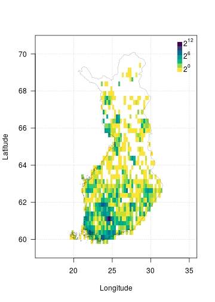

Visualisation is an important part of data exploration and analysis. The
`{finbif}` package has a few functions and methods that can be used to visualise
occurrence data from FinBIF.

## Occurrence points
The default `plot()` method for the result of a call to `finbif_occurrence()`
will display (if available) coordinates of the occurrence points in a
scatter-plot.

```r
recent_obs <- finbif_occurrence(filter = c(country = "Finland"), n = 1000)
```

```r
plot(recent_obs)
```



## Occurrence density
When you have many points to visualise it may be beneficial to display them in
a 2-dimensional histogram with the density of points indicated by the shading
or colour of filled grid-cells. The following outlines how this can be achieved
using some tools provided by `{finbif}`.

### Data
First you'll need to acquire some occurrence records. For example, you can use
the following to get the latitude and longitude of all the Finnish records of
Eurasian Jays where the coordinate uncertainty is less then 100m[^1].

```r
jays <- finbif_occurrence(
  "Eurasian Jay",
  filter = c(coordinates_uncertainty_max = 100, country = "Finland"),
  select = c("lon_wgs84", "lat_wgs84"),
  n = 2e4
)
```

### Breakpoints
Now you will need to define the break points of the grid cells over which to
plot the density of occurrence records.

The `{finbif}` package has an inbuilt Finland map object which includes its
bounding box.

```r
finland_map$bbox
#> [1] 19 59 32 71
```

You can use the function `breaks_xy` in combination with map bounding box to
compute break points that a quarter of a degree in both dimensions.

```r
(breaks <- breaks_xy(finland_map$bbox, size = .25))
#> $x
#>  [1] 19.00 19.25 19.50 19.75 20.00 20.25 20.50 20.75 21.00 21.25 21.50 21.75 22.00 22.25 22.50 22.75
#> [17] 23.00 23.25 23.50 23.75 24.00 24.25 24.50 24.75 25.00 25.25 25.50 25.75 26.00 26.25 26.50 26.75
#> [33] 27.00 27.25 27.50 27.75 28.00 28.25 28.50 28.75 29.00 29.25 29.50 29.75 30.00 30.25 30.50 30.75
#> [49] 31.00 31.25 31.50 31.75 32.00
#> 
#> $y
#>  [1] 59.00 59.25 59.50 59.75 60.00 60.25 60.50 60.75 61.00 61.25 61.50 61.75 62.00 62.25 62.50 62.75
#> [17] 63.00 63.25 63.50 63.75 64.00 64.25 64.50 64.75 65.00 65.25 65.50 65.75 66.00 66.25 66.50 66.75
#> [33] 67.00 67.25 67.50 67.75 68.00 68.25 68.50 68.75 69.00 69.25 69.50 69.75 70.00 70.25 70.50 70.75
#> [49] 71.00
```

### 2d histogram
The function `hist_xy` can be used compute the density of occurrences in the
grid-cells defined by a set of break points.

```r
jay_density <- hist_xy(jays, breaks)
```

### Image
The function `image()` creates a grid of colored rectangles with colors
corresponding to the density of occurrence records. You can use its arguments to
control properties of the plot such as the aspect ratio[^2], the breaks[^3], the
color palette, the axis labels and grid lines.

```r
image(
  jay_density,
  asp    = 2.4,
  breaks = 2^seq(0, 12),
  col    = hcl.colors(12, rev = TRUE),
  xlab   = "Longitude",
  ylab   = "Latitude",
  las    = 1,
  panel.first = grid()
)
```

### Legend
You can add a plot legend to indicate how the image breakpoints are mapped to
the image colors.

```r
legend(
  "topright",
  inset  = c(0, .01),
  legend = expression(2^12, "", "", 2^6, "", "", 2^0),
  fill   = hcl.colors(7),
  border = NA,
  bty    = "n",
  adj    = c(0, 0.25),
  x.intersp = .2,
  y.intersp = .5
)
```

### Border
Finally, you can use `{finbif}`'s internal map to add the border of Finland to
your plot.

```r
polygon(finland_map$vertices, lwd = .2)
```



[^1]: Or the coordinate uncertainty has not been specified.
[^2]: An aspect ratio of 2.4 minimizes the distortion of displaying Finland
      in a unprojected coordinate system.
[^3]: Note that this is different from the break points for the grid cells. This
      `breaks` argument defines the break points for the grid cell colors.
